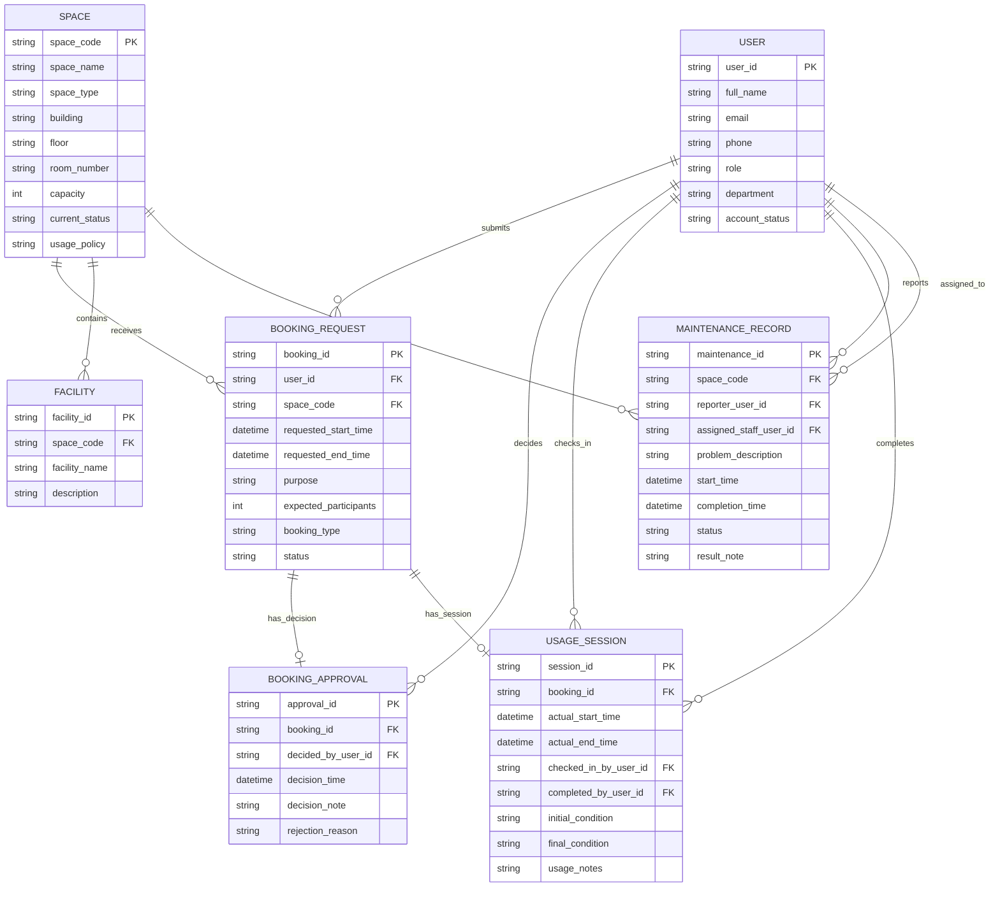

# Section 02: Conceptual Database Design (ERD)

## 1. Entity-Relationship Diagram

## 2. Assumptions & Participation Constraints

The following participation constraints are inferred to properly map the business logic into structural ERD constraints:

1. **Nullable Foreign Keys (Optional Participation on the Many side):** 
   - `USAGE_SESSION.completed_by_user_id`: A session may not be completed immediately upon check-in. Therefore, the relationship `USER ||--o{ USAGE_SESSION : "completes"` implies that while a completed session must map to exactly one user, the foreign key itself is logically optional (0..1) until the completion event occurs.
   - `MAINTENANCE_RECORD.assigned_staff_user_id`: A maintenance record is initially reported but may not be immediately assigned. The foreign key is logically optional (0..1) until assignment.
   - For simplicity and standard structural mapping in Mermaid, the `||--o{` notation is used to represent the relationship path, emphasizing that a valid target `USER` must exist when the field is populated.

2. **Zero-or-One Constraints (0..1):**
   - As mandated by the non-negotiable business rules, a `BOOKING_REQUEST` may exist without a `BOOKING_APPROVAL` (it remains pending/cancelled) and without a `USAGE_SESSION` (it was rejected or no-show). These are explicitly modeled with the `||--o|` notation to enforce the strict zero-or-one constraint on the dependent entities.

3. **Strict Relationship Separation:**
   - Multiple foreign keys referencing the same parent entity (e.g., `USER`) from the same child entity (e.g., `USAGE_SESSION`) are modeled as explicitly separate relationship lines to prevent conflation of distinct business actions (checking in vs. completing). There are exactly 11 relationships modeled.
