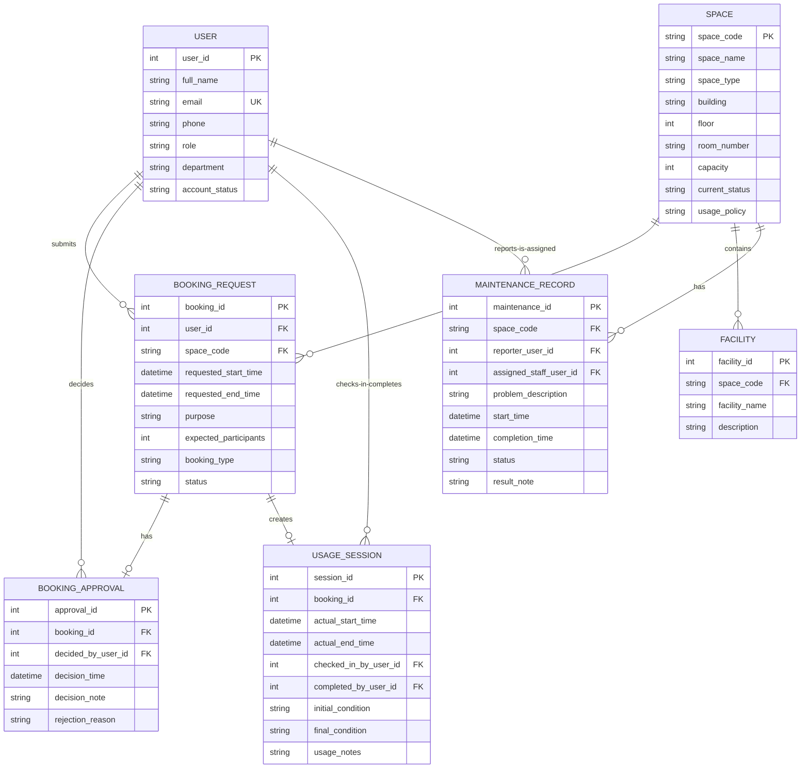

# Conceptual Database Design (ERD) — Shared Campus Space Booking & Facility Management System

## 1. Entity-Relationship Diagram

## 2. Entity Descriptions

| Entity | Description |
|--------|-------------|
| **USER** | Individuals who interact with the system — students, lecturers, teaching assistants, facility staff, department administrators, and facility managers. |
| **SPACE** | Physical rooms or areas available for booking: classrooms, labs, meeting rooms, auditoriums. |
| **FACILITY** | Equipment or amenities within a space (e.g., projector, whiteboard, air conditioning). |
| **BOOKING_REQUEST** | A reservation request submitted by a user for a specific space and time window. |
| **BOOKING_APPROVAL** | The approval or rejection decision linked to exactly one booking request. |
| **USAGE_SESSION** | The check-in and check-out record for an approved booking. |
| **MAINTENANCE_RECORD** | A problem report or work order for a space, including reporter and assigned staff. |

## 3. Attribute Summary

### USER

| Attribute | Type | Constraints |
|-----------|------|-------------|
| **user_id** | INT | PRIMARY KEY |
| full_name | VARCHAR | NOT NULL |
| email | VARCHAR | NOT NULL, UNIQUE |
| phone | VARCHAR | |
| role | VARCHAR | NOT NULL |
| department | VARCHAR | |
| account_status | VARCHAR | NOT NULL |

### SPACE

| Attribute | Type | Constraints |
|-----------|------|-------------|
| **space_code** | VARCHAR | PRIMARY KEY |
| space_name | VARCHAR | NOT NULL |
| space_type | VARCHAR | NOT NULL |
| building | VARCHAR | NOT NULL |
| floor | INT | NOT NULL |
| room_number | VARCHAR | NOT NULL |
| capacity | INT | NOT NULL |
| current_status | VARCHAR | NOT NULL |
| usage_policy | VARCHAR | |

### FACILITY

| Attribute | Type | Constraints |
|-----------|------|-------------|
| **facility_id** | INT | PRIMARY KEY |
| *space_code* | VARCHAR | FOREIGN KEY REFERENCES SPACE(space_code), NOT NULL |
| facility_name | VARCHAR | NOT NULL |
| description | VARCHAR | |

### BOOKING_REQUEST

| Attribute | Type | Constraints |
|-----------|------|-------------|
| **booking_id** | INT | PRIMARY KEY |
| *user_id* | INT | FOREIGN KEY REFERENCES USER(user_id), NOT NULL |
| *space_code* | VARCHAR | FOREIGN KEY REFERENCES SPACE(space_code), NOT NULL |
| requested_start_time | TIMESTAMP | NOT NULL |
| requested_end_time | TIMESTAMP | NOT NULL |
| purpose | VARCHAR | |
| expected_participants | INT | |
| booking_type | VARCHAR | NOT NULL |
| status | VARCHAR | NOT NULL |

### BOOKING_APPROVAL

| Attribute | Type | Constraints |
|-----------|------|-------------|
| **approval_id** | INT | PRIMARY KEY |
| *booking_id* | INT | FOREIGN KEY REFERENCES BOOKING_REQUEST(booking_id), UNIQUE, NOT NULL |
| *decided_by_user_id* | INT | FOREIGN KEY REFERENCES USER(user_id), NOT NULL |
| decision_time | TIMESTAMP | NOT NULL |
| decision_note | VARCHAR | |
| rejection_reason | VARCHAR | |

### USAGE_SESSION

| Attribute | Type | Constraints |
|-----------|------|-------------|
| **session_id** | INT | PRIMARY KEY |
| *booking_id* | INT | FOREIGN KEY REFERENCES BOOKING_REQUEST(booking_id), UNIQUE, NOT NULL |
| actual_start_time | TIMESTAMP | |
| actual_end_time | TIMESTAMP | |
| *checked_in_by_user_id* | INT | FOREIGN KEY REFERENCES USER(user_id) |
| *completed_by_user_id* | INT | FOREIGN KEY REFERENCES USER(user_id) |
| initial_condition | VARCHAR | |
| final_condition | VARCHAR | |
| usage_notes | VARCHAR | |

### MAINTENANCE_RECORD

| Attribute | Type | Constraints |
|-----------|------|-------------|
| **maintenance_id** | INT | PRIMARY KEY |
| *space_code* | VARCHAR | FOREIGN KEY REFERENCES SPACE(space_code), NOT NULL |
| *reporter_user_id* | INT | FOREIGN KEY REFERENCES USER(user_id), NOT NULL |
| *assigned_staff_user_id* | INT | FOREIGN KEY REFERENCES USER(user_id) |
| problem_description | VARCHAR | NOT NULL |
| start_time | TIMESTAMP | NOT NULL |
| completion_time | TIMESTAMP | |
| status | VARCHAR | NOT NULL |
| result_note | VARCHAR | |

## 4. Relationship Summary

| Entity A | Relationship | Entity B | Cardinality | Description |
|----------|-------------|----------|-------------|-------------|
| USER | submits | BOOKING_REQUEST | 1:N | A user may submit many booking requests. |
| USER | decides | BOOKING_APPROVAL | 1:N | A user may approve or reject many requests. |
| USER | checks-in / completes | USAGE_SESSION | 1:N | A user may check in or complete many usage sessions. |
| USER | reports / is assigned | MAINTENANCE_RECORD | 1:N | A user may report or be assigned many maintenance records. |
| SPACE | receives | BOOKING_REQUEST | 1:N | A space may receive many booking requests. |
| SPACE | contains | FACILITY | 1:N | A space may contain many facilities. |
| SPACE | has | MAINTENANCE_RECORD | 1:N | A space may have many maintenance records. |
| BOOKING_REQUEST | has | BOOKING_APPROVAL | 1:0..1 | A booking request has zero or one approval record. |
| BOOKING_REQUEST | creates | USAGE_SESSION | 1:0..1 | A booking request creates zero or one usage session. |
