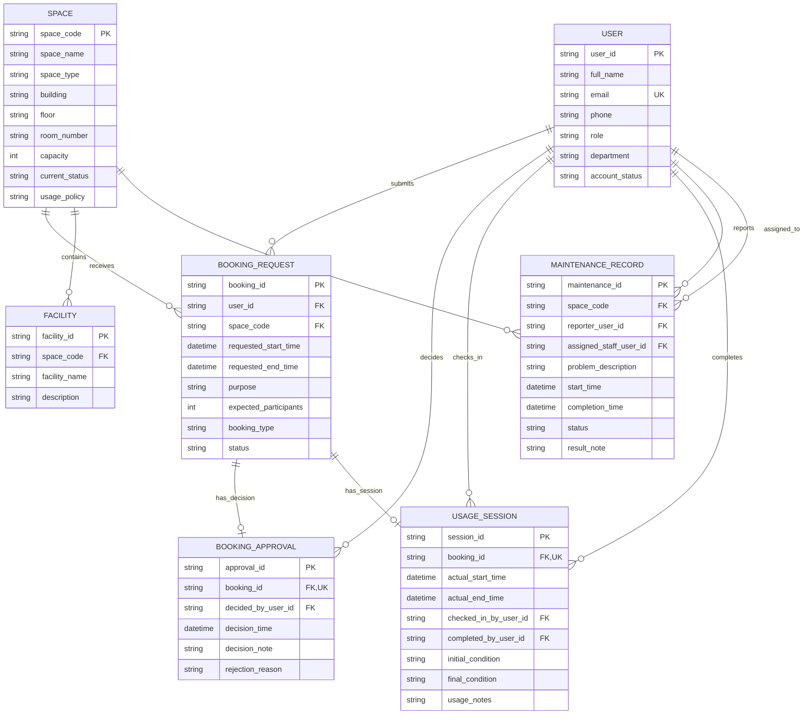

# Section 02: Conceptual Database Design (ERD)

## 1. Entity-Relationship Diagram

## 2. Explicit Relationships Summary

| Entity A | Relationship | Entity B | Cardinality | Constraint |
|----------|-------------|----------|-------------|------------|
| USER | submits | BOOKING_REQUEST | 1:N | `user_id` FK (Mandatory) |
| SPACE | receives | BOOKING_REQUEST | 1:N | `space_code` FK (Mandatory) |
| SPACE | contains | FACILITY | 1:N | `space_code` FK (Mandatory) |
| SPACE | requires | MAINTENANCE_RECORD | 1:N | `space_code` FK (Mandatory) |
| USER | decides | BOOKING_APPROVAL | 1:N | `decided_by_user_id` FK (Mandatory) |
| USER | checks_in | USAGE_SESSION | 1:N | `checked_in_by_user_id` FK (Mandatory) |
| USER | completes | USAGE_SESSION | 1:N | `completed_by_user_id` FK (Logically Optional until completion) |
| USER | reports | MAINTENANCE_RECORD | 1:N | `reporter_user_id` FK (Mandatory) |
| USER | assigned_to | MAINTENANCE_RECORD | 1:N | `assigned_staff_user_id` FK (Logically Optional until assigned) |
| BOOKING_REQUEST | has_decision | BOOKING_APPROVAL | 1:1 | `booking_id` FK, UK (Optional / 0..1) |
| BOOKING_REQUEST | has_session | USAGE_SESSION | 1:1 | `booking_id` FK, UK (Optional / 0..1) |

## 3. Assumptions & Participation Constraints

The following participation constraints are inferred to properly map the business logic into structural ERD constraints:

1. **Nullable Foreign Keys (Optional Participation on the Many side):** 
   - `USAGE_SESSION.completed_by_user_id`: A session may not be completed immediately upon check-in. Therefore, the relationship `USER ||--o{ USAGE_SESSION : "completes"` implies that while a completed session must map to exactly one user, the foreign key itself is logically optional (0..1) until the completion event occurs.
   - `MAINTENANCE_RECORD.assigned_staff_user_id`: A maintenance record is initially reported but may not be immediately assigned. The foreign key is logically optional (0..1) until assignment.
   - For structural mapping in Mermaid, `||--o{` is used to represent the path, emphasizing that when populated, a valid target `USER` must exist.

2. **Zero-or-One Constraints (0..1) and Unique Keys (UK):**
   - As mandated by the non-negotiable business rules, a `BOOKING_REQUEST` may exist without a `BOOKING_APPROVAL` (it remains pending/cancelled) and without a `USAGE_SESSION` (it was rejected or no-show). These are explicitly modeled with the `||--o|` notation.
   - Since these are 1:0..1 relationships, their respective foreign keys (`booking_id`) inside `BOOKING_APPROVAL` and `USAGE_SESSION` have been explicitly annotated as `UK` (Unique Keys).

3. **Strict Relationship Separation:**
   - Multiple foreign keys referencing the same parent entity (e.g., `USER`) from the same child entity (e.g., `USAGE_SESSION`) are modeled as explicitly separate relationship lines to prevent conflation of distinct business actions. This guarantees all 11 relationships are distinct and traceable.
