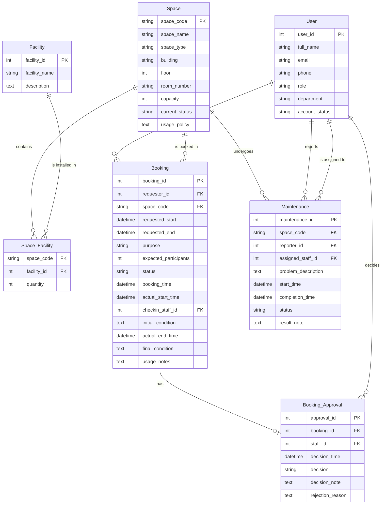

# Conceptual ERD Design — G08

**Sources:** `project_description.md` and `req/business-requirement.md`

## Entity-Relationship Diagram (Crow's Foot Notation)

## Domain Value Sets

| Attribute | Allowed Values |
|-----------|---------------|
| User.role | Student, Lecturer, TA, Facility Staff, Dept Administrator, Facility Manager |
| User.account_status | Active, Inactive, Suspended |
| Space.space_type | Auditorium, Classroom, Computer Lab, Project Lab, Meeting Room, Workspace |
| Space.current_status | Available, In Use, Under Maintenance, Temporarily Closed, Retired |
| Booking.purpose | Lecture, Examination, Seminar, Workshop, Meeting, Student Activity, Administrative Event |
| Booking.status | Pending, Approved, Rejected, Cancelled, Checked In, Completed, No-Show |
| Booking_Approval.decision | Approved, Rejected |
| Maintenance.status | Open, In Progress, Resolved, Closed |

## Relationship Summary

| Entity 1 | Entity 2 | Type | Description |
|----------|----------|------|-------------|
| User | Booking | 1:N | A user submits many bookings; each booking belongs to one user. |
| Space | Booking | 1:N | A space may have many bookings over time; each booking is for one space. |
| Booking | Booking_Approval | 1:1 | Each booking has at most one approval decision. |
| User | Booking_Approval | 1:N | A staff user may decide on many booking approvals. |
| Space | Facility | M:N | Via Space_Facility; a space may have many facilities, a facility may be in many spaces. |
| Space | Maintenance | 1:N | A space may have many maintenance records. |
| User (reporter) | Maintenance | 1:N | A user may report many maintenance issues. |
| User (assigned) | Maintenance | 1:N | A staff user may be assigned to many maintenance records. |

## Participation Constraints

| Relationship | Entity | Participation |
|-------------|--------|---------------|
| submits | User | Optional — user may have zero bookings |
| submits | Booking | Mandatory — every booking has a requester |
| is booked in | Space | Optional — space may have zero bookings |
| is booked in | Booking | Mandatory — every booking is for a space |
| has | Booking | Optional — booking may not yet be decided |
| has | Booking_Approval | Mandatory — each approval belongs to a booking |
| decides | User | Optional — user may never approve anything |
| decides | Booking_Approval | Mandatory — each decision is made by a staff user |
| contains | Space | Optional — space may have no special facilities |
| contains | Space_Facility | Mandatory — each record links to a space |
| is installed in | Facility | Optional — facility may not be in any space yet |
| is installed in | Space_Facility | Mandatory — each record links to a facility |
| undergoes | Space | Optional — space may have zero maintenance records |
| undergoes | Maintenance | Mandatory — each maintenance record is for a space |
| reports | User | Optional — user may report zero issues |
| reports | Maintenance | Mandatory — each issue has a reporter |
| is assigned to | User | Optional — user may never be assigned maintenance |
| is assigned to | Maintenance | Optional — issue may not yet be assigned |
