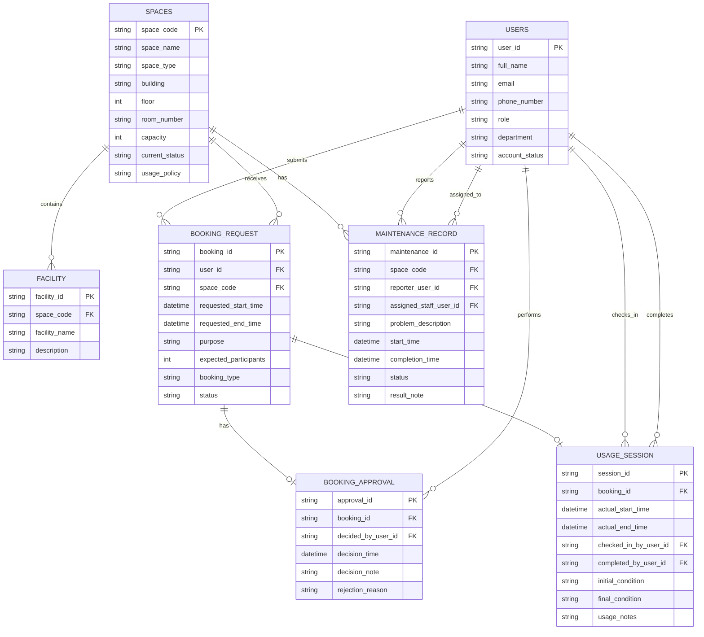

# 02-erd-design-G08.md

# Conceptual Database Design (ER Diagram)

## ER Diagram (Mermaid)

# Main Entities

The Campus Space Management System consists of seven main entities:

- **User**: Represents university members who interact with the system, including students, lecturers, teaching assistants, facility staff, department administrators, and facility managers.

- **Space**: Represents bookable campus spaces such as classrooms, laboratories, meeting rooms, and auditoriums.

- **Facility**: Represents equipment or resources available inside a space.

- **Booking_Request**: Represents a user's request to reserve a space for a specific time period and purpose.

- **Booking_Approval**: Represents the approval or rejection decision associated with a booking request.

- **Usage_Session**: Represents the actual usage of a booking from check-in until completion.

- **Maintenance_Record**: Represents maintenance activities and issue reports associated with a space.

# Main Attributes

## User

- user_id (PK)
- full_name
- email
- phone_number
- role
- department
- account_status

## Space

- space_code (PK)
- space_name
- space_type
- building
- floor
- room_number
- capacity
- current_status
- usage_policy

## Facility

- facility_id (PK)
- space_code (FK)
- facility_name
- description

## Booking_Request

- booking_id (PK)
- user_id (FK)
- space_code (FK)
- requested_start_time
- requested_end_time
- purpose
- expected_participants
- booking_type
- status

## Booking_Approval

- approval_id (PK)
- booking_id (FK)
- decided_by_user_id (FK)
- decision_time
- decision_note
- rejection_reason

## Usage_Session

- session_id (PK)
- booking_id (FK)
- actual_start_time
- actual_end_time
- checked_in_by_user_id (FK)
- completed_by_user_id (FK)
- initial_condition
- final_condition
- usage_notes

## Maintenance_Record

- maintenance_id (PK)
- space_code (FK)
- reporter_user_id (FK)
- assigned_staff_user_id (FK)
- problem_description
- start_time
- completion_time
- status
- result_note

# Main Relationships

The ERD contains the following relationships:

- A Space contains Facilities.
- A User submits Booking_Requests.
- A Space receives Booking_Requests.
- A Booking_Request may have a Booking_Approval.
- A User performs Booking_Approvals.
- A Booking_Request may create a Usage_Session.
- A User checks in a Usage_Session.
- A User completes a Usage_Session.
- A Space has Maintenance_Records.
- A User reports Maintenance_Records.
- A User may be assigned to Maintenance_Records.

# Cardinalities

| Relationship | Cardinality |
|--------------|-------------|
| Space contains Facility | 1 : N |
| User submits Booking_Request | 1 : N |
| Space receives Booking_Request | 1 : N |
| Booking_Request has Booking_Approval | 1 : 0..1 |
| User performs Booking_Approval | 1 : N |
| Booking_Request creates Usage_Session | 1 : 0..1 |
| User checks in Usage_Session | 1 : N |
| User completes Usage_Session | 1 : N |
| Space has Maintenance_Record | 1 : N |
| User reports Maintenance_Record | 1 : N |
| User assigned to Maintenance_Record | 1 : N |

# Participation Constraints Summary

## Total Participation

- Every Facility must belong to one Space.
- Every Booking_Request must be submitted by one User.
- Every Booking_Request must belong to one Space.
- Every Booking_Approval must belong to one Booking_Request.
- Every Booking_Approval must be performed by one User.
- Every Usage_Session must belong to one Booking_Request.
- Every Usage_Session must be checked in by one User.
- Every Maintenance_Record must belong to one Space.
- Every Maintenance_Record must be reported by one User.
- Every Maintenance_Record must be assigned to one User.

## Partial Participation

### User

- A User may have zero or many Booking_Requests.
- A User may have zero or many Booking_Approvals.
- A User may have zero or many Usage_Sessions (as check-in staff).
- A User may have zero or many Usage_Sessions (as completion staff).
- A User may have zero or many Maintenance_Records (as reporter).
- A User may have zero or many Maintenance_Records (as assigned staff).

### Space

- A Space may have zero or many Facilities.
- A Space may have zero or many Booking_Requests.
- A Space may have zero or many Maintenance_Records.

### Booking_Request

- A Booking_Request may have zero or one Booking_Approval.
- A Booking_Request may create zero or one Usage_Session.

### Usage_Session

- A Usage_Session may be completed by one User.

# Notes

This ERD follows the business analysis and business rules defined in Phase 1 requirements.

Some business rules, such as preventing overlapping bookings and restricting unavailable spaces from being booked, will be enforced at the logical and implementation stages because they cannot be fully represented in an ER diagram.