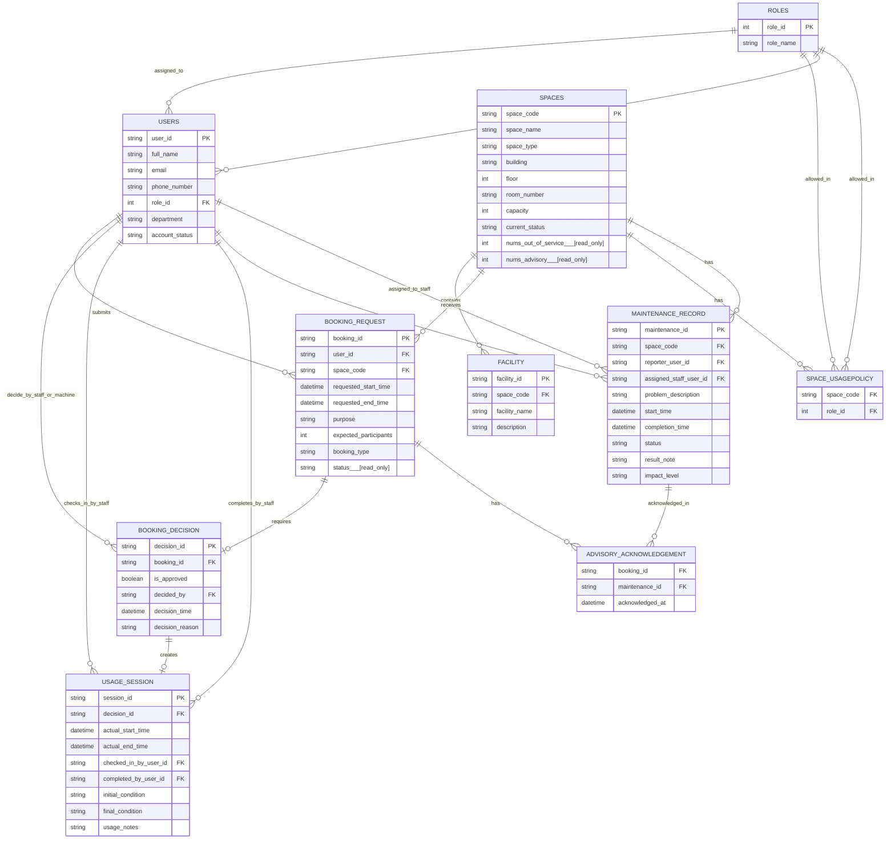

## ER Diagram (Mermaid)

### Design Notes

| ID | Constraint | Purpose |
|----|------------|---------|
| **A1** | `SPACE_USAGEPOLICY (space_code, role_id)` is a **composite primary key**. | Prevent duplicate role permissions for the same space. |
| **A2** | `ADVISORY_ACKNOWLEDGEMENT (booking_id, maintenance_id)` is a **composite primary key**. | Prevent duplicate acknowledgements for the same booking and maintenance record. |
| **A3** | `BOOKING_DECISION.booking_id` is **UNIQUE**. | Ensure each booking request has at most one approval/rejection decision. |
| **A4** | `USAGE_SESSION.decision_id` is **UNIQUE**. | Ensure each approved booking creates at most one usage session. |
| **A5** | `BOOKING_REQUEST.status` is **system-maintained (read-only)**. | Status is updated automatically by business rules and workflow. |
| **A6** | `SPACES.nums_out_of_service` and `SPACES.nums_advisory` are **derived attributes** maintained automatically from active maintenance records. |