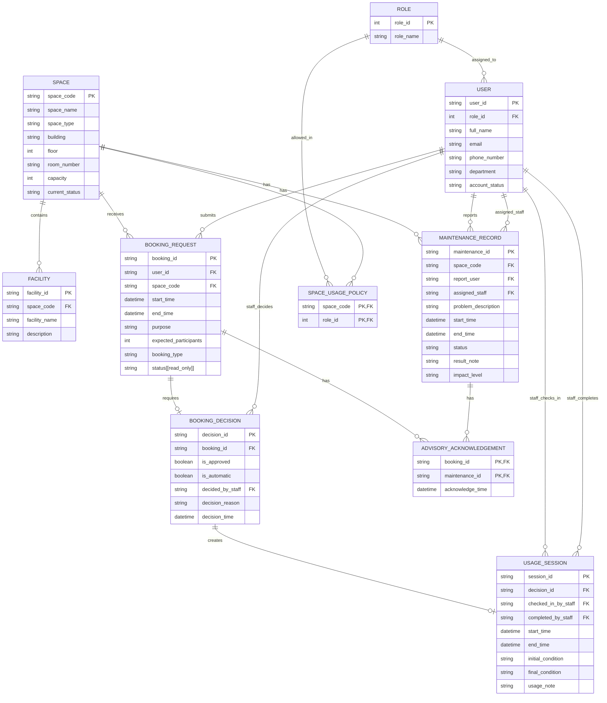

# 09 - Updated ERD and Logical Design (G08)

## 1. Purpose and scope

This document updates the Phase 1 ERD and relational design in
`02-erd-design-G08.md` and `03-logical-design-G08.md` for the Phase 2
requirements.

The conceptual ERD in Section 3 is the authoritative source for:

- entity names;
- attribute names;
- primary keys;
- foreign keys;
- relationships;
- relationship cardinalities; and
- participation constraints.

All relational definitions, integrity rules, reporting notes, concurrency
requirements, physical-design guidance, and migration notes in the remaining
sections follow that ERD without adding attributes or relations that do not
appear in the diagram.

The updated design supports:

- `advisory` and `out_of_service` maintenance impact levels;
- acknowledgement of every active advisory shown to a requester at booking
  time;
- both automatic and staff booking decisions;
- role-based space usage policies;
- safe concurrent approval of requests for the same space;
- identification of approved bookings affected by out-of-service maintenance;
  and
- the required Phase 2 analytical reports.

Cross-row business rules, especially booking-conflict prevention, cannot be
enforced by keys and `CHECK` constraints alone. They must also be enforced by
transactional SQL procedures, as described in Section 8.

## 2. Summary of changes from Phase 1

| Phase 1 design                                            | Phase 2 update                                                         | Reason                                                                                 |
| --------------------------------------------------------- | ---------------------------------------------------------------------- | -------------------------------------------------------------------------------------- |
| `USER.role` was stored as free text                       | Add `ROLE`; replace the text role with `USER.role_id`                  | Gives each user and usage policy a stable role reference                               |
| `SPACE.usage_policy` was stored as free text              | Add `SPACE_USAGE_POLICY`                                               | Makes allowed user roles queryable                                                     |
| `BOOKING_APPROVAL` represented only staff approval        | Replace it with `BOOKING_DECISION`                                     | Records approval or rejection and distinguishes automatic from non-automatic decisions |
| A maintenance record had no impact level                  | Add `MAINTENANCE_RECORD.impact_level`                                  | Distinguishes advisory maintenance from maintenance that makes a space unavailable     |
| All active maintenance prevented booking                  | Only overlapping active `out_of_service` maintenance prevents approval | Implements the revised maintenance requirement                                         |
| No advisory acknowledgement was stored                    | Add `ADVISORY_ACKNOWLEDGEMENT`                                         | Records which advisories were acknowledged for each booking                            |
| `USAGE_SESSION` referred directly to a booking            | Make `USAGE_SESSION.decision_id` reference `BOOKING_DECISION`          | Connects a usage session to the decision that authorized it                            |
| Booking status could be treated as ordinary editable data | Mark `BOOKING_REQUEST.status` as read-only                             | Keeps lifecycle state changes under system-controlled procedures                       |

No separate automatic-approval configuration relation or attribute appears in
the ERD. Therefore, `SPACE_USAGE_POLICY` represents only whether the role of
the booking requester is allowed to use the requested space. The list of space
types selected for automatic approval is an operational rule evaluated by the
application or stored procedure using `SPACE.space_type`. The resulting
decision source is recorded by `BOOKING_DECISION.is_automatic`.

## 3. Updated conceptual ERD



### 3.1 Cardinalities and participation

| Relationship                                    | Cardinality | Participation rule                                                                                                                    |
| ----------------------------------------------- | ----------: | ------------------------------------------------------------------------------------------------------------------------------------- |
| `ROLE`–`USER`                                   |         1:N | Every `USER` references exactly one `ROLE`; a `ROLE` may be assigned to zero or many users                                            |
| `ROLE`–`SPACE_USAGE_POLICY`                     |         1:N | Every policy row references exactly one role; a role may appear in zero or many policy rows                                           |
| `SPACE`–`SPACE_USAGE_POLICY`                    |         1:N | Every policy row references exactly one space; a space may have zero or many allowed-role rows                                        |
| `SPACE`–`FACILITY`                              |         1:N | Every facility belongs to exactly one space; a space may contain zero or many facilities                                              |
| `USER`–`BOOKING_REQUEST`                        |         1:N | Every booking request is submitted by exactly one user; a user may submit zero or many requests                                       |
| `SPACE`–`BOOKING_REQUEST`                       |         1:N | Every booking request is for exactly one space; a space may receive zero or many requests                                             |
| `BOOKING_REQUEST`–`BOOKING_DECISION`            |      1:0..1 | A pending request may have no decision; each request may have at most one decision                                                    |
| `USER`–`BOOKING_DECISION`                       |         1:N | Every decision references exactly one user through `decided_by_staff`; a user may be referenced by zero or many decisions             |
| `BOOKING_DECISION`–`USAGE_SESSION`              |      1:0..1 | A decision may create zero or one usage session; every usage session references exactly one decision                                  |
| `USER`–`USAGE_SESSION` (check-in)               |         1:N | Every usage session references exactly one user through `checked_in_by_staff`                                                         |
| `USER`–`USAGE_SESSION` (completion)             |         1:N | Every usage session references exactly one user through `completed_by_staff`                                                          |
| `SPACE`–`MAINTENANCE_RECORD`                    |         1:N | Every maintenance record concerns exactly one space; a space may have zero or many maintenance records                                |
| `USER`–`MAINTENANCE_RECORD` (reporter)          |         1:N | Every maintenance record references exactly one reporting user through `report_user`                                                  |
| `USER`–`MAINTENANCE_RECORD` (assignee)          |         1:N | Every maintenance record references exactly one assigned user through `assigned_staff`                                                |
| `BOOKING_REQUEST`–`ADVISORY_ACKNOWLEDGEMENT`    |         1:N | Every acknowledgement references exactly one booking; a booking may have zero or many acknowledgement rows                            |
| `MAINTENANCE_RECORD`–`ADVISORY_ACKNOWLEDGEMENT` |         1:N | Every acknowledgement references exactly one maintenance record; a maintenance record may appear in zero or many acknowledgement rows |

`SPACE_USAGE_POLICY` and `ADVISORY_ACKNOWLEDGEMENT` are associative relations.
Their pairs of foreign keys are also composite primary keys, exactly as shown
in the ERD:

```text
SPACE_USAGE_POLICY primary key:
    (space_code, role_id)

ADVISORY_ACKNOWLEDGEMENT primary key:
    (booking_id, maintenance_id)
```

For an automatic decision, `BOOKING_DECISION.is_automatic = 1`. Because the
ERD also requires every decision to reference one `USER` through
`decided_by_staff`, an automatic decision must use a designated system account
stored in `USER`. A staff decision uses the actual authorized staff user.
`is_automatic` is the authoritative attribute for distinguishing the two
decision types.

## 4. Updated relational schema summary

| Relation                   | Primary key                      | Foreign keys                                               | Candidate or alternate keys implied by the ERD |
| -------------------------- | -------------------------------- | ---------------------------------------------------------- | ---------------------------------------------- |
| `ROLE`                     | `role_id`                        | —                                                          | —                                              |
| `USER`                     | `user_id`                        | `role_id`                                                  | —                                              |
| `SPACE`                    | `space_code`                     | —                                                          | —                                              |
| `FACILITY`                 | `facility_id`                    | `space_code`                                               | —                                              |
| `SPACE_USAGE_POLICY`       | (`space_code`, `role_id`)        | `space_code`, `role_id`                                    | —                                              |
| `BOOKING_REQUEST`          | `booking_id`                     | `user_id`, `space_code`                                    | —                                              |
| `BOOKING_DECISION`         | `decision_id`                    | `booking_id`, `decided_by_staff`                           | `booking_id`                                   |
| `USAGE_SESSION`            | `session_id`                     | `decision_id`, `checked_in_by_staff`, `completed_by_staff` | `decision_id`                                  |
| `MAINTENANCE_RECORD`       | `maintenance_id`                 | `space_code`, `report_user`, `assigned_staff`              | —                                              |
| `ADVISORY_ACKNOWLEDGEMENT` | (`booking_id`, `maintenance_id`) | `booking_id`, `maintenance_id`                             | —                                              |

The candidate key on `BOOKING_DECISION.booking_id` implements the
`BOOKING_REQUEST`–`BOOKING_DECISION` cardinality of one to zero-or-one.

The candidate key on `USAGE_SESSION.decision_id` implements the
`BOOKING_DECISION`–`USAGE_SESSION` cardinality of one to zero-or-one.

## 5. Relation definitions

The following definitions are logical relation definitions. SQL Server data
types, defaults, indexes, migration operations, and transactional procedure
implementations belong in the corresponding SQL deliverables.

### 5.1 `ROLE`

```text
ROLE(
    role_id                  INT,
    role_name                VARCHAR(50)
)
```

Constraints:

- Primary key: `role_id`.
- `role_name` is required.
- The ERD does not declare `role_name` as a candidate key, so no additional
  uniqueness constraint is assumed in this logical design.

### 5.2 `USER`

```text
USER(
    user_id                  VARCHAR(20),
    role_id                  INT,
    full_name                VARCHAR(100),
    email                    VARCHAR(100),
    phone_number             VARCHAR(20),
    department               VARCHAR(100),
    account_status           VARCHAR(30)
)
```

Constraints:

- Primary key: `user_id`.
- Foreign key: `role_id` → `ROLE(role_id)`.
- `role_id`, `full_name`, `email`, and `account_status` are required.
- `account_status` is restricted to:

```text
active
inactive
suspended
```

- The ERD does not mark `email` as a candidate key, so this document does not
  introduce an email uniqueness rule.

### 5.3 `SPACE`

```text
SPACE(
    space_code               VARCHAR(20),
    space_name               VARCHAR(100),
    space_type               VARCHAR(50),
    building                 VARCHAR(50),
    floor                    INT,
    room_number              VARCHAR(20),
    capacity                 INT,
    current_status           VARCHAR(30)
)
```

Constraints:

- Primary key: `space_code`.
- `space_name`, `space_type`, `building`, `floor`, `room_number`, `capacity`,
  and `current_status` are required.
- `capacity > 0`.
- `current_status` is restricted to:

```text
available
in_use
temporarily_closed
retired
```

The ERD does not store a general `under_maintenance` space status. Maintenance
availability is determined from `MAINTENANCE_RECORD.status`,
`MAINTENANCE_RECORD.impact_level`, and the maintenance interval. This supports
multiple simultaneous maintenance records with different impact levels.

For a future booking search, `available` and `in_use` spaces may be considered,
provided that the requested interval does not conflict with an approved booking
or active out-of-service maintenance. `temporarily_closed` and `retired` spaces
are not bookable.

### 5.4 `FACILITY`

```text
FACILITY(
    facility_id              VARCHAR(20),
    space_code               VARCHAR(20),
    facility_name            VARCHAR(100),
    description              VARCHAR(MAX)
)
```

Constraints:

- Primary key: `facility_id`.
- Foreign key: `space_code` → `SPACE(space_code)`.
- `space_code` and `facility_name` are required.
- `description` may be nullable.

The room finder uses this relation to verify that a candidate space contains
every facility requested by the user.

### 5.5 `SPACE_USAGE_POLICY`

```text
SPACE_USAGE_POLICY(
    space_code               VARCHAR(20),
    role_id                  INT
)
```

Constraints:

- Composite primary key: (`space_code`, `role_id`).
- Foreign key: `space_code` → `SPACE(space_code)`.
- Foreign key: `role_id` → `ROLE(role_id)`.
- Both attributes are required.

A row represents the following fact:

```text
Users whose USER.role_id equals SPACE_USAGE_POLICY.role_id
may request the space identified by SPACE_USAGE_POLICY.space_code.
```

Therefore, usage-policy validation is performed by matching the role of the
booking requester with an allowed role for the requested space:

```text
BOOKING_REQUEST.user_id
    → USER.role_id
    → SPACE_USAGE_POLICY.role_id

and

BOOKING_REQUEST.space_code
    = SPACE_USAGE_POLICY.space_code
```

The policy relation does not determine whether the request is automatically
approved. Automatic versus staff processing is recorded by
`BOOKING_DECISION.is_automatic`. Any operational list of automatically
approvable space types is evaluated using `SPACE.space_type` outside this
relation.

### 5.6 `BOOKING_REQUEST`

```text
BOOKING_REQUEST(
    booking_id               VARCHAR(20),
    user_id                  VARCHAR(20),
    space_code               VARCHAR(20),
    start_time               DATETIME2,
    end_time                 DATETIME2,
    purpose                  VARCHAR(MAX),
    expected_participants    INT,
    booking_type             VARCHAR(50),
    status                   VARCHAR(30)
)
```

Constraints:

- Primary key: `booking_id`.
- Foreign key: `user_id` → `USER(user_id)`.
- Foreign key: `space_code` → `SPACE(space_code)`.
- `user_id`, `space_code`, `start_time`, `end_time`,
  `expected_participants`, `booking_type`, and `status` are required.
- `end_time > start_time`.
- `expected_participants > 0`.
- At approval time, `expected_participants` must not exceed
  `SPACE.capacity`.
- `status` is restricted to:

```text
pending
approved
rejected
cancelled
checked_in
completed
no_show
```

`status` is marked `read_only` in the ERD. Clients must not update it directly.
Only approved database procedures or trusted system operations may perform
lifecycle transitions.

Booking and maintenance intervals use half-open semantics:

```text
[start_time, end_time)
```

Consequently, a booking that ends at 10:00 does not overlap another booking
that starts at 10:00.

### 5.7 `BOOKING_DECISION`

```text
BOOKING_DECISION(
    decision_id              VARCHAR(20),
    booking_id               VARCHAR(20),
    is_approved              BIT,
    is_automatic             BIT,
    decided_by_staff         VARCHAR(20),
    decision_reason          VARCHAR(MAX),
    decision_time            DATETIME2
)
```

Constraints:

- Primary key: `decision_id`.
- Candidate key: `booking_id`.
- Foreign key: `booking_id` → `BOOKING_REQUEST(booking_id)`.
- Foreign key: `decided_by_staff` → `USER(user_id)`.
- `booking_id`, `is_approved`, `is_automatic`, `decided_by_staff`, and
  `decision_time` are required.
- A booking request can have at most one decision because `booking_id` is
  unique.
- `is_approved = 1` records approval.
- `is_approved = 0` records rejection.
- `is_automatic = 1` records an automatic decision.
- `is_automatic = 0` records a staff decision.
- For `is_automatic = 0`, `decided_by_staff` must reference an authorized,
  active staff user.
- For `is_automatic = 1`, `decided_by_staff` must reference the designated
  system account represented in `USER`.
- A rejection should have a non-empty `decision_reason`.
- An approval may also have a decision reason or explanatory note.
- An approved decision may be inserted only after the common role, capacity,
  space-status, advisory, maintenance, and booking-conflict checks succeed.

The relationship name `staff_decides` and the attribute name
`decided_by_staff` are preserved exactly from the ERD. The designated system
account is used for automatic decisions because the relationship requires one
referenced `USER` for every decision.

### 5.8 `USAGE_SESSION`

```text
USAGE_SESSION(
    session_id               VARCHAR(20),
    decision_id              VARCHAR(20),
    checked_in_by_staff      VARCHAR(20),
    completed_by_staff       VARCHAR(20),
    start_time               DATETIME2,
    end_time                 DATETIME2,
    initial_condition        VARCHAR(MAX),
    final_condition          VARCHAR(MAX),
    usage_note               VARCHAR(MAX)
)
```

Constraints:

- Primary key: `session_id`.
- Candidate key: `decision_id`.
- Foreign key: `decision_id` → `BOOKING_DECISION(decision_id)`.
- Foreign key: `checked_in_by_staff` → `USER(user_id)`.
- Foreign key: `completed_by_staff` → `USER(user_id)`.
- `decision_id`, `checked_in_by_staff`, `completed_by_staff`, `start_time`,
  and `end_time` are required.
- `end_time >= start_time`.
- Only a `BOOKING_DECISION` with `is_approved = 1` may create a usage session.
- A decision may create at most one usage session because `decision_id` is
  unique.
- The users referenced by `checked_in_by_staff` and `completed_by_staff` must
  be authorized staff accounts.

The ERD requires both a check-in user and a completion user for every
`USAGE_SESSION`. Therefore, the relation represents a complete usage-session
record containing both the check-in and completion information.

### 5.9 `MAINTENANCE_RECORD`

```text
MAINTENANCE_RECORD(
    maintenance_id           VARCHAR(20),
    space_code               VARCHAR(20),
    report_user              VARCHAR(20),
    assigned_staff           VARCHAR(20),
    problem_description      VARCHAR(MAX),
    start_time               DATETIME2,
    end_time                 DATETIME2,
    status                   VARCHAR(30),
    result_note              VARCHAR(MAX),
    impact_level             VARCHAR(20)
)
```

Constraints:

- Primary key: `maintenance_id`.
- Foreign key: `space_code` → `SPACE(space_code)`.
- Foreign key: `report_user` → `USER(user_id)`.
- Foreign key: `assigned_staff` → `USER(user_id)`.
- `space_code`, `report_user`, `assigned_staff`, `problem_description`,
  `start_time`, `status`, and `impact_level` are required.
- `end_time` may be null while the maintenance record is open.
- If `end_time` is not null, then `end_time >= start_time`.
- `status` is restricted to:

```text
pending
in_progress
completed
cancelled
```

- `impact_level` is restricted to:

```text
advisory
out_of_service
```

- A completed maintenance record must have an `end_time`.
- Multiple maintenance records may overlap for the same space, including
  records with different impact levels.

For interval checks, a maintenance record affects:

```text
[start_time, end_time)
```

When `end_time` is null, it is treated as having no known upper bound.

A maintenance record is operationally active when:

```text
status IN ('pending', 'in_progress')
```

An active record overlaps a booking interval when:

```text
maintenance.start_time < booking.end_time
AND booking.start_time < COALESCE(maintenance.end_time, infinity)
```

Only an overlapping active record whose `impact_level = 'out_of_service'`
prevents approval. An overlapping active advisory does not prevent approval,
but it must be shown and acknowledged.

### 5.10 `ADVISORY_ACKNOWLEDGEMENT`

```text
ADVISORY_ACKNOWLEDGEMENT(
    booking_id               VARCHAR(20),
    maintenance_id           VARCHAR(20),
    acknowledge_time         DATETIME2
)
```

Constraints:

- Composite primary key: (`booking_id`, `maintenance_id`).
- Foreign key: `booking_id` → `BOOKING_REQUEST(booking_id)`.
- Foreign key: `maintenance_id` →
  `MAINTENANCE_RECORD(maintenance_id)`.
- `acknowledge_time` is required.
- A pair can occur at most once because it is the composite primary key.
- An acknowledgement may be inserted only when the referenced maintenance
  record:
  - belongs to the same space as the booking;
  - has `impact_level = 'advisory'`;
  - has an active status; and
  - overlaps the booking interval.
- Every active overlapping advisory shown during submission must have a
  corresponding acknowledgement row before automatic or staff approval.
- The acknowledgement remains as historical evidence even if the maintenance
  record is later completed, escalated, or downgraded.

The booking request and all acknowledgement rows should be created in one
transaction so that the stored acknowledgement set corresponds to the
advisories presented during submission.

## 6. Derived data and reporting support

The ERD does not store report totals or interval-derived values. The following
values are calculated when needed:

- approved booking duration;
- total approved booking hours;
- weekday and hour buckets;
- current counts of active advisory and out-of-service maintenance records;
- room availability for a requested interval; and
- the set of approved bookings affected by an out-of-service escalation.

| Phase 2 report                                                  | Relations used                                                                   |
| --------------------------------------------------------------- | -------------------------------------------------------------------------------- |
| Total approved booking hours of each space for a semester       | `SPACE`, `BOOKING_REQUEST`, `BOOKING_DECISION`                                   |
| Number of approved bookings by weekday and hour                 | `BOOKING_REQUEST`, `BOOKING_DECISION`                                            |
| Available spaces by capacity, required facilities, and interval | `SPACE`, `FACILITY`, `BOOKING_REQUEST`, `BOOKING_DECISION`, `MAINTENANCE_RECORD` |
| Approved bookings affected by maintenance escalation            | `MAINTENANCE_RECORD`, `BOOKING_REQUEST`, `BOOKING_DECISION`, `USER`              |

Semester start and semester end are query parameters supplied by the academic
calendar. No semester relation or semester attributes are added because they
do not appear in the authoritative ERD.

### 6.1 Approved booking definition

A booking has an approved decision when:

```text
BOOKING_DECISION.booking_id = BOOKING_REQUEST.booking_id
AND BOOKING_DECISION.is_approved = 1
```

A booking remains historically approved when its lifecycle status later becomes
`checked_in`, `completed`, or `no_show`. A cancelled booking is excluded from
current reservation-conflict and affected-booking results because it no longer
reserves the space.

### 6.2 Approved booking affected by out-of-service maintenance

An approved booking is affected when:

```text
booking.space_code = maintenance.space_code
AND decision.booking_id = booking.booking_id
AND decision.is_approved = 1
AND booking.status <> 'cancelled'
AND booking.start_time < COALESCE(maintenance.end_time, infinity)
AND maintenance.start_time < booking.end_time
```

When an open maintenance record is escalated from `advisory` to
`out_of_service`, this predicate identifies the already-approved overlapping
bookings for staff follow-up. The requirement is to identify those bookings;
the design does not automatically cancel them.

### 6.3 Room finder conditions

A space is returned by the room finder only when:

1. `SPACE.current_status` permits future booking;
2. `SPACE.capacity` is at least the required capacity;
3. the space contains every requested facility;
4. no non-cancelled booking with an approved decision overlaps the requested
   interval; and
5. no active `out_of_service` maintenance record overlaps the requested
   interval.

Active advisories do not remove a space from the room-finder result. They must
be returned with the candidate space so that the requester can review and
acknowledge them.

### 6.4 Usage-policy check

The usage-policy assumption is exactly:

```text
The role of the booking requester must match an allowed role for the space.
```

Logically:

```text
EXISTS (
    USER u,
    SPACE_USAGE_POLICY p
    WHERE u.user_id = booking.user_id
      AND p.space_code = booking.space_code
      AND p.role_id = u.role_id
)
```

No purpose-based, department-based, or booking-type-based policy is added
because those policy dimensions do not appear in the ERD.

## 7. Integrity and business rules

| Rule                                                           | Enforcement mechanism                                      |
| -------------------------------------------------------------- | ---------------------------------------------------------- |
| Entity primary keys                                            | Declarative `PRIMARY KEY` constraints                      |
| ERD foreign keys                                               | Declarative `FOREIGN KEY` constraints                      |
| Composite uniqueness of usage-policy pairs                     | `SPACE_USAGE_POLICY` composite primary key                 |
| Composite uniqueness of acknowledgement pairs                  | `ADVISORY_ACKNOWLEDGEMENT` composite primary key           |
| At most one decision for each booking                          | `UNIQUE` constraint on `BOOKING_DECISION.booking_id`       |
| At most one usage session for each decision                    | `UNIQUE` constraint on `USAGE_SESSION.decision_id`         |
| Valid status, impact, and account values                       | `CHECK` constraints                                        |
| Positive space capacity and participant count                  | `CHECK` constraints                                        |
| Booking and maintenance interval validity                      | `CHECK` constraints                                        |
| Requester account is active                                    | Transactional submission or approval procedure             |
| Requester role is allowed for the space                        | Transactional submission or approval procedure             |
| Participant count does not exceed space capacity               | Transactional approval procedure                           |
| Automatic versus staff decision is recorded                    | `BOOKING_DECISION.is_automatic`                            |
| Staff decision uses an authorized active staff user            | Transactional procedure or trigger plus foreign key        |
| Automatic decision uses the designated system account          | Transactional procedure or trigger plus foreign key        |
| Every active overlapping advisory is acknowledged              | Submission and approval procedures                         |
| Active out-of-service maintenance blocks approval              | Serialized approval procedure                              |
| Two approved bookings cannot overlap for one space             | Serialized approval procedure                              |
| Booking status follows system-controlled lifecycle transitions | Stored procedures and restricted direct-update permissions |
| Only an approved decision creates a usage session              | Procedure or trigger                                       |
| Maintenance escalation returns affected approved bookings      | Escalation procedure or query                              |

A database index may accelerate a conflict search, but an index alone does not
prevent two concurrent transactions from both observing no conflict and then
approving overlapping bookings.

## 8. Concurrency implications of the design

Automatic approval at submission time and later staff approval must use the
same approval routine. All approval paths must enforce the same role,
availability, maintenance, advisory, capacity, and booking-conflict rules.

Within one transaction, the routine must:

1. load the booking request;
2. obtain a serialization lock keyed by the requested `space_code`;
3. reload the booking request while holding the lock;
4. confirm that `BOOKING_REQUEST.status = 'pending'`;
5. confirm that the requester has an active `USER.account_status`;
6. confirm that the requester role matches a row in
   `SPACE_USAGE_POLICY` for the requested space;
7. confirm that the space status permits booking;
8. confirm that `expected_participants <= SPACE.capacity`;
9. reject approval if an active overlapping
   `MAINTENANCE_RECORD` has `impact_level = 'out_of_service'`;
10. verify that every active overlapping advisory has a corresponding
    `ADVISORY_ACKNOWLEDGEMENT` row;
11. reject approval if another non-cancelled booking with an approved decision
    satisfies:

```text
existing_booking.start_time < new_booking.end_time
AND new_booking.start_time < existing_booking.end_time
```

12. insert one `BOOKING_DECISION` row;
13. set:
    - `is_approved = 1`;
    - `is_automatic = 1` and `decided_by_staff` to the designated system
      account for an automatic approval; or
    - `is_automatic = 0` and `decided_by_staff` to the authorized staff user
      for a staff approval;
14. update the read-only booking status to `approved`; and
15. commit.

A rejection inserts a `BOOKING_DECISION` with `is_approved = 0`, records the
appropriate `is_automatic` value, records the decision actor in
`decided_by_staff`, stores `decision_reason`, and changes the booking status to
`rejected`.

The lock must cover both the conflict checks and the writes. A lock keyed by
space permits unrelated spaces to be processed concurrently. Every procedure
that can approve a booking must acquire locks in the same order to reduce
deadlock risk.

For SQL Server, one suitable implementation is a transaction-owned
`sp_getapplock` resource such as:

```text
SPACE_BOOKING:<space_code>
```

The exact procedure and conflict demonstration belong in
`12-concurrency-implementation-G08.sql` and
`13-concurrency-tests-G08/`.

The ERD does not store the set of space types selected for automatic approval.
That operational list must be supplied to the application or approval
procedure and evaluated against `SPACE.space_type`. This does not change the
usage-policy rule: usage policy is only the match between the requester's role
and the allowed role for the space.

## 9. Initial physical-design guidance

The exact indexes and before-and-after measurements belong in
`15-index-tuning-report-G08.md`. Based on the authoritative ERD, the relevant
search attributes are:

### 9.1 Booking-conflict check

Frequently used attributes:

```text
BOOKING_REQUEST.space_code
BOOKING_REQUEST.start_time
BOOKING_REQUEST.end_time
BOOKING_REQUEST.status
BOOKING_DECISION.booking_id
BOOKING_DECISION.is_approved
```

The conflict check must efficiently locate approved, non-cancelled bookings for
one space that may overlap a requested interval.

### 9.2 Room finder

Frequently used attributes:

```text
SPACE.current_status
SPACE.capacity
FACILITY.space_code
FACILITY.facility_name
BOOKING_REQUEST.space_code
BOOKING_REQUEST.start_time
BOOKING_REQUEST.end_time
BOOKING_REQUEST.status
BOOKING_DECISION.booking_id
BOOKING_DECISION.is_approved
MAINTENANCE_RECORD.space_code
MAINTENANCE_RECORD.start_time
MAINTENANCE_RECORD.end_time
MAINTENANCE_RECORD.status
MAINTENANCE_RECORD.impact_level
```

### 9.3 Approved-hours report

Frequently used attributes:

```text
BOOKING_REQUEST.space_code
BOOKING_REQUEST.start_time
BOOKING_REQUEST.end_time
BOOKING_REQUEST.status
BOOKING_DECISION.booking_id
BOOKING_DECISION.is_approved
```

### 9.4 Escalation report

Frequently used attributes:

```text
MAINTENANCE_RECORD.space_code
MAINTENANCE_RECORD.start_time
MAINTENANCE_RECORD.end_time
MAINTENANCE_RECORD.impact_level
BOOKING_REQUEST.space_code
BOOKING_REQUEST.start_time
BOOKING_REQUEST.end_time
BOOKING_REQUEST.status
BOOKING_DECISION.booking_id
BOOKING_DECISION.is_approved
BOOKING_REQUEST.user_id
```

Indexes are physical implementation aids. They do not replace the serialized
approval transaction.

## 10. Migration notes

The Phase 2 migration must preserve existing Phase 1 rows or document any rows
that cannot be migrated automatically.

The migration should perform the following transformations:

1. Create `ROLE`.
2. Populate `ROLE` from the known Phase 1 user-role values.
3. Add and populate `USER.role_id`.
4. Create the foreign key from `USER.role_id` to `ROLE.role_id`.
5. Create `SPACE_USAGE_POLICY` with composite primary key
   (`space_code`, `role_id`).
6. Convert parseable Phase 1 `SPACE.usage_policy` values into policy rows,
   documenting any values that require manual mapping.
7. Add `MAINTENANCE_RECORD.impact_level`.
8. Assign legacy maintenance rows the documented value `out_of_service`,
   because Phase 1 treated all maintenance as booking-blocking.
9. Preserve or map the Phase 1 maintenance completion timestamp into
   `MAINTENANCE_RECORD.end_time`.
10. Create `BOOKING_DECISION` with:
    - `decision_id`;
    - `booking_id`;
    - `is_approved`;
    - `is_automatic`;
    - `decided_by_staff`;
    - `decision_reason`; and
    - `decision_time`.
11. Add a unique constraint on `BOOKING_DECISION.booking_id`.
12. Migrate each Phase 1 staff approval or rejection with
    `is_automatic = 0`.
13. Derive `is_approved` from the corresponding Phase 1 outcome.
14. Copy the Phase 1 deciding staff user into `decided_by_staff`.
15. Create a designated system account in `USER` for future automatic
    decisions.
16. Set future automatic decisions to `is_automatic = 1` and reference that
    account through `decided_by_staff`.
17. Replace the Phase 1 `USAGE_SESSION.booking_id` reference with
    `USAGE_SESSION.decision_id`.
18. Rename or map usage-session attributes to exactly match the ERD:
    - `checked_in_by_staff`;
    - `completed_by_staff`;
    - `start_time`;
    - `end_time`;
    - `initial_condition`;
    - `final_condition`; and
    - `usage_note`.
19. Add a unique constraint on `USAGE_SESSION.decision_id`.
20. Ensure each migrated usage session references an approved decision and has
    both required staff references.
21. Create `ADVISORY_ACKNOWLEDGEMENT` with composite primary key
    (`booking_id`, `maintenance_id`).
22. Leave the acknowledgement relation initially empty because Phase 1 had no
    advisory-acknowledgement facts.
23. Rename or map booking interval columns to exactly:
    - `BOOKING_REQUEST.start_time`; and
    - `BOOKING_REQUEST.end_time`.
24. Remove obsolete Phase 1 free-text role and usage-policy columns only after
    validating:
    - source and destination row counts;
    - role mappings;
    - usage-policy mappings;
    - foreign-key coverage;
    - decision mappings; and
    - usage-session mappings.

Legacy maintenance rows must not be assigned `advisory` without evidence.
Doing so would weaken the Phase 1 booking-blocking rule and could make
previously protected time periods bookable.

## 11. Final design consistency statement

The relational design in this document conforms to the ERD in Section 3 in the
following ways:

- Every relation corresponds to exactly one ERD entity.
- Every relation uses the exact attribute names shown in the ERD.
- Every primary key shown in the ERD is represented in the logical schema.
- Both associative entities use the composite primary keys shown in the ERD.
- Every foreign key corresponds to an ERD relationship.
- The `1:0..1` relationships are implemented with unique foreign keys.
- `BOOKING_DECISION.is_automatic` distinguishes automatic decisions from staff
  decisions.
- `BOOKING_DECISION.decided_by_staff` always references one `USER`, including
  the designated system account used for automatic decisions.
- `SPACE_USAGE_POLICY` implements only role-to-space authorization, as assumed.
- Booking status remains system-managed because the ERD marks it as read-only.
- No additional relation or attribute has been introduced outside the
  authoritative ERD.
