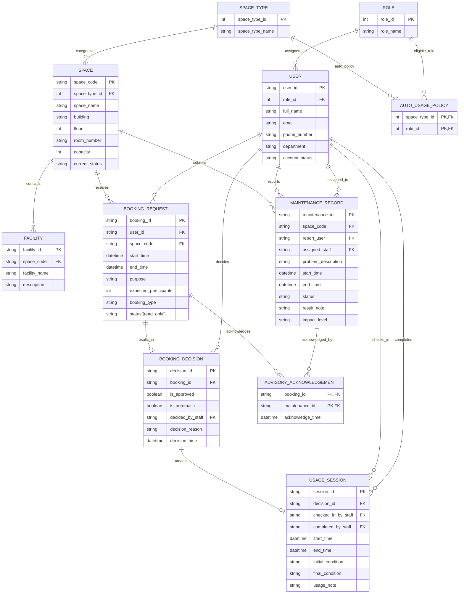

# 09 - Updated ERD and Logical Design (G08)

## 1. Design objectives

This document presents the updated conceptual Entity–Relationship Diagram (ERD) and logical schema for Phase 2 of the Campus Space Management System. The updated design extends the Phase 1 database to support the revised maintenance rules, concurrent booking and approval operations, and the additional analytical queries required by the Phase 2 specification.

The objectives of the updated logical design are to:

- support `advisory` and `out_of_service` maintenance impact levels;
- record requester acknowledgements for active advisory maintenance;
- support both automatic and staff booking decisions through a unified `BOOKING_DECISION` relation;
- support automatic booking processing for eligible user roles and space types;
- preserve data consistency during concurrent booking and approval operations;
- provide the data required by the analytical queries specified in Phase 2 without storing redundant derived information; and
- maintain a normalized logical schema that can be directly implemented through schema migration from the Phase 1 database.

## 2. Design assumptions

- Every space belongs to exactly one predefined space type represented by the `SPACE_TYPE` relation.
- `AUTO_USAGE_POLICY` identifies the (`space_type`, `role`) combinations that are eligible for automatic booking processing. Booking requests without a matching policy are processed through the staff approval workflow.
- `BOOKING_REQUEST.status` represents the booking lifecycle and is maintained exclusively by the system. It is therefore treated as a read-only attribute in the logical model.
- Booking availability is determined from both `SPACE.current_status` and active `MAINTENANCE_RECORD`s. The space status represents the operational state of the space, while maintenance records determine whether an overlapping booking is blocked by `out_of_service` maintenance or accompanied by active `advisory` maintenance.
- A maintenance record is considered active while its status is `pending` or `in_progress`. Completed and cancelled maintenance records are retained for historical purposes but do not affect future booking decisions.
- Semester boundaries are supplied as query parameters. No separate semester relation is introduced because it is not required by the Phase 2 specification.

## 3. Design changes from Phase 1

Compared with the Phase 1 design, the logical model has been updated as follows:

- Introduced the `ROLE` relation to normalize user roles.
- Introduced the `SPACE_TYPE` relation and replaced the `space_type` attribute in `SPACE` with a foreign key.
- Replaced the `usage_policy` attribute in `SPACE` with the `AUTO_USAGE_POLICY` relation, which identifies the (`space_type`, `role`) combinations eligible for automatic booking processing.
- Replaced `BOOKING_APPROVAL` with `BOOKING_DECISION` to unify automatic and staff booking decisions in a single relation.
- Updated `USAGE_SESSION` to reference `BOOKING_DECISION` instead of `BOOKING_REQUEST`.
- Extended `MAINTENANCE_RECORD` with the `impact_level` attribute to distinguish between `advisory` and `out_of_service` maintenance.
- Added `ADVISORY_ACKNOWLEDGEMENT` to record requester acknowledgements for active advisory maintenance.


## 4. Updated conceptual ERD




## 5. Relation definitions

This section defines the logical relations derived from the conceptual ERD. Each relation represents one conceptual entity and specifies the operational information maintained by the database. Together, these relations provide the foundation for the booking, maintenance, and reporting functions introduced in Phase 2.

### 5.1 `ROLE`

```text
ROLE(
    role_id,
    role_name
)
```

The `ROLE` relation defines the predefined user roles recognized by the system. Each user is assigned exactly one role, and the role is used when determining eligibility for automatic booking processing.

---

### 5.2 `USER`

```text
USER(
    user_id,
    role_id,
    full_name,
    email,
    phone_number,
    department,
    account_status
)
```

The `USER` relation stores user accounts together with their assigned roles and account status. A user may submit booking requests, report maintenance issues, perform staff booking decisions, and manage usage sessions depending on the assigned role.

---

### 5.3 `SPACE_TYPE`

```text
SPACE_TYPE(
    space_type_id,
    space_type_name
)
```

The `SPACE_TYPE` relation classifies spaces into predefined categories. Each space belongs to exactly one space type, allowing booking policies to be defined for groups of similar spaces instead of individual spaces.

---

### 5.4 `SPACE`

```text
SPACE(
    space_code,
    space_type_id,
    space_name,
    building,
    floor,
    room_number,
    capacity,
    current_status
)
```

The `SPACE` relation stores the physical characteristics and operational status of each space. Besides its descriptive information, a space is associated with facilities, maintenance records, and booking requests throughout its lifetime.

The `current_status` attribute represents the operational state of the space. Maintenance availability is evaluated together with active maintenance records rather than from this attribute alone.

---

### 5.5 `AUTO_USAGE_POLICY`

```text
AUTO_USAGE_POLICY(
    space_type_id,
    role_id
)
```

The `AUTO_USAGE_POLICY` relation identifies the (`space_type`, `role`) combinations that are eligible for automatic booking processing.

If a booking request matches a record in this relation, the request follows the automatic approval workflow. Otherwise, it follows the staff approval workflow. The relation therefore determines only the processing path and does not represent the final booking decision.

---

### 5.6 `FACILITY`

```text
FACILITY(
    facility_id,
    space_code,
    facility_name,
    description
)
```

The `FACILITY` relation stores the facilities available in each space. Facility information supports space search and booking selection based on user requirements.

---

### 5.7 `BOOKING_REQUEST`

```text
BOOKING_REQUEST(
    booking_id,
    user_id,
    space_code,
    start_time,
    end_time,
    purpose,
    expected_participants,
    booking_type,
    status
)
```

The `BOOKING_REQUEST` relation records booking requests submitted by users. Each request specifies the requested space, booking interval, intended purpose, and expected number of participants.

The `status` attribute represents the booking lifecycle and is maintained exclusively by the system. It records the operational state of the booking request after each processing stage.

---

### 5.8 `BOOKING_DECISION`

```text
BOOKING_DECISION(
    decision_id,
    booking_id,
    is_approved,
    is_automatic,
    decided_by_staff,
    decision_reason,
    decision_time
)
```

The `BOOKING_DECISION` relation stores the outcome of each booking request. Every booking request may produce at most one booking decision, recording whether the request is approved or rejected.

The relation provides a unified representation for both automatic and staff decisions. The `is_automatic` attribute distinguishes the processing workflow, while `decided_by_staff` records the responsible staff member when the decision is made manually.

---

### 5.9 `USAGE_SESSION`

```text
USAGE_SESSION(
    session_id,
    decision_id,
    checked_in_by_staff,
    completed_by_staff,
    start_time,
    end_time,
    initial_condition,
    final_condition,
    usage_note
)
```

The `USAGE_SESSION` relation records the actual use of an approved booking. It captures check-in, completion, and the condition of the space before and after use, providing an operational history of space utilization.

---

### 5.10 `MAINTENANCE_RECORD`

```text
MAINTENANCE_RECORD(
    maintenance_id,
    space_code,
    report_user,
    assigned_staff,
    problem_description,
    start_time,
    end_time,
    status,
    result_note,
    impact_level
)
```

The `MAINTENANCE_RECORD` relation stores maintenance activities associated with each space. A maintenance record progresses through its own lifecycle independently of booking requests.

The `impact_level` attribute distinguishes between `advisory` and `out_of_service` maintenance. Multiple active maintenance records with different impact levels may exist simultaneously for the same space because different maintenance activities may affect the space in different ways.

---

### 5.11 `ADVISORY_ACKNOWLEDGEMENT`

```text
ADVISORY_ACKNOWLEDGEMENT(
    booking_id,
    maintenance_id,
    acknowledge_time
)
```

The `ADVISORY_ACKNOWLEDGEMENT` relation records that a requester acknowledged an active advisory maintenance record before the corresponding booking request was processed. This relation preserves the acknowledgement history independently of both booking decisions and maintenance records.


## 6. Logical semantics and analytical-query support

The logical schema stores only operational data. Concepts required for booking processing and analytical queries are derived from the stored relations rather than maintained as persistent attributes. The following definitions are used consistently throughout the remaining design documents.

### 6.1 Approved booking

A booking is considered approved when it has a corresponding `BOOKING_DECISION` with `is_approved = true`.

An approved booking remains part of the historical record even after its lifecycle changes to `checked_in`, `completed`, or `no_show`. Consequently, analytical queries such as booking utilization and total approved booking hours are based on booking decisions rather than on the current booking status.

---

### 6.2 Automatic booking processing

A booking request follows the automatic approval workflow when the requester's role and the requested space type match a record in `AUTO_USAGE_POLICY`.

If no matching record exists, the booking request follows the staff approval workflow. Regardless of the processing path, every booking request ultimately produces at most one `BOOKING_DECISION`, providing a unified representation of booking outcomes.

---

### 6.3 Available space

A space is considered available for a requested booking interval when all of the following conditions are satisfied:

- the current operational status of the space permits booking;
- the space capacity satisfies the requested number of participants;
- the space contains all required facilities;
- no approved booking overlaps the requested interval; and
- no active `out_of_service` maintenance record overlaps the requested interval.

Active `advisory` maintenance records do not exclude a space from the search result. Instead, they are presented to the requester and must be acknowledged before the booking request proceeds to the decision stage.

---

### 6.4 Bookings affected by maintenance escalation

When an active maintenance record changes its impact level from `advisory` to `out_of_service`, the system identifies all approved bookings for the same space whose booking intervals overlap the maintenance period.

The identified bookings support operational follow-up by facility staff. The logical model identifies the affected bookings but does not prescribe how they are subsequently handled.

---

### 6.5 Analytical-query support

The logical schema directly supports the analytical queries required by the Phase 2 specification, including:

- total approved booking hours for each space;
- approved booking distributions by weekday and hour;
- available-space search based on capacity, required facilities, and booking interval; and
- identification of approved bookings affected by maintenance escalation.

The database does not store report totals, booking durations, availability flags, or other analytical summaries because these values can be derived from the operational relations when queries are executed.


## 7. Integrity constraints and business rules

The logical schema enforces the Phase 2 business rules through a combination of declarative constraints and transactional procedures. Declarative constraints preserve the structural integrity of individual relations, while transactional procedures enforce rules involving multiple relations, temporal conditions, or concurrent operations.

The primary integrity requirements are summarized below.

| Business rule | Primary enforcement mechanism |
| --- | --- |
| Entity identity | `PRIMARY KEY` constraints |
| Referential integrity | `FOREIGN KEY` constraints |
| Valid status and impact values | `CHECK` constraints |
| Valid booking and maintenance intervals | `CHECK` constraints |
| One booking decision per booking request | `UNIQUE` constraint |
| One usage session per booking decision | `UNIQUE` constraint |
| Automatic processing eligibility | `AUTO_USAGE_POLICY` lookup |
| Space capacity validation | Transactional approval procedure |
| Advisory acknowledgement validation | Transactional approval procedure |
| Maintenance availability validation | Transactional approval procedure |
| Booking conflict prevention | Serialized approval procedure |
| Booking lifecycle management | Stored procedures |

Declarative constraints are sufficient for rules that involve a single relation, such as entity identity, referential integrity, enumerated values, and interval validity. However, rules involving booking conflicts, maintenance availability, advisory acknowledgements, or automatic booking eligibility require data from multiple relations and therefore cannot be enforced by declarative constraints alone.

The booking approval procedure is responsible for validating these business rules before recording a `BOOKING_DECISION`. By centralizing validation in a single transactional workflow, both automatic and staff approval paths enforce identical business rules and produce consistent booking decisions.


## 8. Concurrency implications of the design

Phase 2 introduces automatic booking processing together with concurrent booking and approval operations. Multiple users, staff members, and background processes may simultaneously submit booking requests, approve bookings, or update maintenance records for the same space. Without appropriate concurrency control, these concurrent operations may violate the business rules represented by the logical model.

Both automatic and staff approval workflows produce the same `BOOKING_DECISION` relation and therefore must enforce the same validation rules. Regardless of the processing path, every booking request should be evaluated using a single approval procedure to ensure consistent behavior.

Within one transaction, the approval procedure should validate:

- whether the booking qualifies for automatic processing by checking `AUTO_USAGE_POLICY`;
- whether the booking request is still pending;
- whether the requester account is active;
- whether the requested participant count does not exceed the space capacity;
- whether the requested interval overlaps an approved booking;
- whether the requested interval overlaps an active `out_of_service` maintenance record; and
- whether every overlapping `advisory` maintenance record has been acknowledged before the booking decision is recorded.

Only after all validations succeed should the procedure record a `BOOKING_DECISION` and update the corresponding booking status. If any validation fails, the booking request is rejected and the appropriate decision is recorded.

To prevent conflicting approvals, the validation phase and the decision-recording phase should execute within the same serialized transaction. Serializing approval operations for the same space prevents multiple transactions from simultaneously observing the space as available and subsequently approving overlapping bookings.

The logical model defines the data and relationships required to support these operations. The implementation of transaction management, locking strategy, and concurrency testing is described in the subsequent implementation documents.


## 9. Design consistency statement

The updated logical design provides a complete and consistent representation of the Phase 2 database requirements. Every conceptual entity and relationship introduced by the revised specification is represented explicitly in the ERD and mapped directly to a logical relation.

The logical model separates operational data from derived information. Booking requests, booking decisions, usage sessions, maintenance records, and advisory acknowledgements are stored as independent relations, while concepts such as approved bookings, available spaces, and maintenance-affected bookings are derived from these operational relations when required. This approach minimizes data redundancy while preserving complete operational history.

The design also separates structural constraints from operational business rules. Entity identity, referential integrity, and simple domain constraints can be enforced declaratively, whereas booking approval, maintenance validation, advisory acknowledgement, and booking-conflict prevention require transactional processing because they involve multiple relations and concurrent operations.

The logical schema serves as the authoritative specification for the remaining implementation documents. Subsequent documents derive the physical schema, concurrency-control mechanisms, indexing strategy, and analytical queries directly from the logical model without introducing additional entities or changing the semantics defined in this document.

Overall, the updated logical design is consistent with the conceptual ERD and satisfies the Phase 2 requirements by:

- representing every conceptual entity as a logical relation;
- preserving every relationship defined in the ERD through appropriate foreign keys;
- supporting automatic and staff booking workflows through a unified `BOOKING_DECISION` relation;
- identifying automatic booking eligibility through `AUTO_USAGE_POLICY`;
- supporting the revised maintenance model using `impact_level` and `ADVISORY_ACKNOWLEDGEMENT`;
- preserving complete historical information for booking, maintenance, decision, acknowledgement, and usage records; and
- providing a normalized foundation for schema migration, concurrency control, and analytical-query implementation.