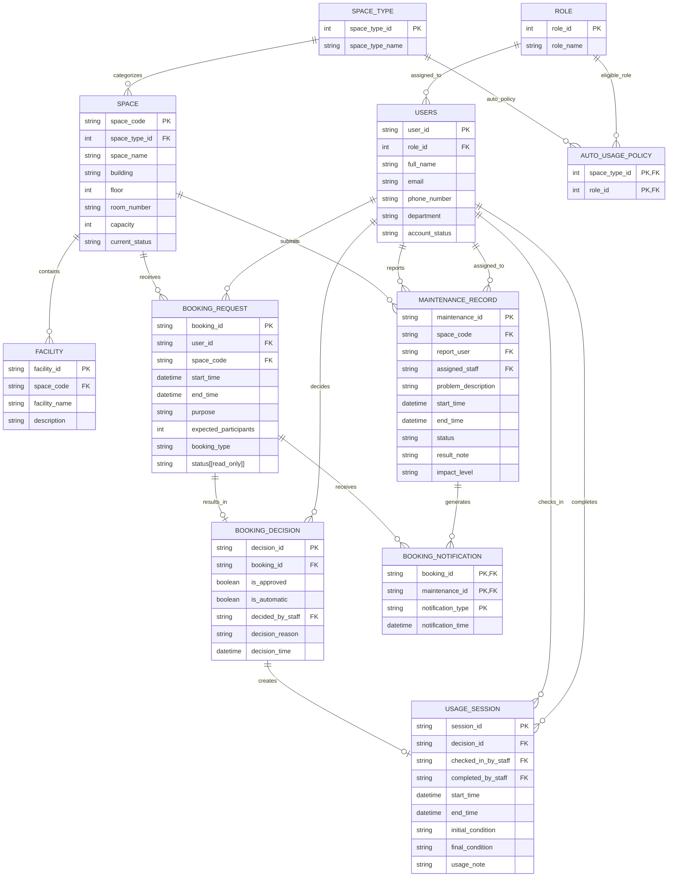

# 09 - Updated ERD and Logical Design (G08)

# 1. Design objectives

This document presents the updated conceptual Entity–Relationship Diagram (ERD) and logical schema for Phase 2 of the Campus Space Management System. The updated design extends the Phase 1 database to support the revised maintenance rules, concurrent booking and approval operations, booking notifications, and the additional analytical queries required by the Phase 2 specification.

The objectives of the updated logical design are to:

- support `advisory` and `out_of_service` maintenance impact levels;
- record booking notifications generated by maintenance events;
- support both automatic and staff booking decisions through a unified `BOOKING_DECISION` relation;
- support automatic booking processing for eligible user roles and space types;
- preserve data consistency during concurrent booking and approval operations;
- provide the data required by the analytical queries specified in Phase 2 without storing redundant derived information; and
- maintain a normalized logical schema that can be directly implemented through schema migration from the Phase 1 database.

---

# 2. Design assumptions

- Every space belongs to exactly one predefined space type represented by the `SPACE_TYPE` relation.
- `AUTO_USAGE_POLICY` identifies the (`space_type`, `role`) combinations that are eligible for automatic booking processing. Booking requests without a matching policy are processed through the staff approval workflow.
- `BOOKING_REQUEST.status` represents the booking lifecycle and is maintained exclusively by the system. It is therefore treated as a read-only attribute in the logical model.
- Booking availability is determined from both `SPACE.current_status` and active `MAINTENANCE_RECORD`s. The space status represents the operational state of the space, while maintenance records determine whether an overlapping booking is blocked by `out_of_service` maintenance or accompanied by active `advisory` maintenance.
- A maintenance record is considered active while its status is `pending` or `in_progress`. Completed and cancelled maintenance records are retained for historical purposes but do not affect future booking decisions.
- The system records booking notifications generated by maintenance events. A booking may receive multiple notifications for the same maintenance record, provided each notification represents a different notification type.
- Semester boundaries are supplied as query parameters. No separate `SEMESTER` relation is introduced because it is not required by the Phase 2 specification.

---

# 3. Design changes from Phase 1

Compared with the Phase 1 design, the logical model has been updated as follows:

- Introduced the `ROLE` relation to normalize user roles.
- Introduced the `SPACE_TYPE` relation and replaced the `space_type` attribute in `SPACE` with a foreign key.
- Replaced the `usage_policy` attribute in `SPACE` with the `AUTO_USAGE_POLICY` relation, which identifies the (`space_type`, `role`) combinations eligible for automatic booking processing.
- Replaced `BOOKING_APPROVAL` with `BOOKING_DECISION` to unify automatic and staff booking decisions in a single relation.
- Updated `USAGE_SESSION` to reference `BOOKING_DECISION` instead of `BOOKING_REQUEST`.
- Extended `MAINTENANCE_RECORD` with the `impact_level` attribute to distinguish between `advisory` and `out_of_service` maintenance.
- Replaced `ADVISORY_ACKNOWLEDGEMENT` with `BOOKING_NOTIFICATION`, which records maintenance-related notifications associated with booking requests and supports multiple notification types, including `ADVISORY` and `OUT_OF_SERVICE`.


## 4. Updated conceptual ERD




## 5. Relation definitions

This section defines the logical relations derived from the conceptual ERD. Each relation represents one conceptual entity and specifies the operational information maintained by the database. Together, these relations support the booking, maintenance, notification, and reporting functions introduced in Phase 2.

### 5.1 `ROLE`

```text
ROLE(
    role_id,
    role_name
)
```

The `ROLE` relation defines the predefined user roles recognized by the system. Each user is assigned exactly one role, and the role determines eligibility for automatic booking processing.

---

### 5.2 `USERS`

```text
USERS(
    user_id,
    role_id,
    full_name,
    email,
    phone_number,
    department,
    account_status
)
```

The `USERS` relation stores user accounts together with their assigned roles and account status. Depending on the assigned role, a user may submit booking requests, report maintenance issues, approve bookings, or manage usage sessions.

---

### 5.3 `SPACE_TYPE`

```text
SPACE_TYPE(
    space_type_id,
    space_type_name
)
```

The `SPACE_TYPE` relation classifies spaces into predefined categories. Each space belongs to exactly one space type, allowing booking policies to be managed consistently across similar spaces.

---

### 5.4 `SPACE`

```text
SPACE(
    space_code,
    space_type_id,
    space_name,
    building,
    floor,
    room_number,
    capacity,
    current_status
)
```

The `SPACE` relation stores the physical characteristics and operational status of each space. A space may have multiple facilities, booking requests, and maintenance records throughout its lifetime.

The `current_status` attribute represents the current operational state of the space. Booking availability is determined together with active maintenance records rather than this attribute alone.

---

### 5.5 `AUTO_USAGE_POLICY`

```text
AUTO_USAGE_POLICY(
    space_type_id,
    role_id
)
```

The `AUTO_USAGE_POLICY` relation identifies the (`space_type`, `role`) combinations that are eligible for automatic booking processing.

If a booking request matches a record in this relation, the request may be processed automatically. Otherwise, it proceeds through the staff approval workflow.

---

### 5.6 `FACILITY`

```text
FACILITY(
    facility_id,
    space_code,
    facility_name,
    description
)
```

The `FACILITY` relation stores the facilities available in each space. These facilities are used when searching for suitable spaces that satisfy user requirements.

---

### 5.7 `BOOKING_REQUEST`

```text
BOOKING_REQUEST(
    booking_id,
    user_id,
    space_code,
    start_time,
    end_time,
    purpose,
    expected_participants,
    booking_type,
    status
)
```

The `BOOKING_REQUEST` relation records booking requests submitted by users. Each request specifies the requested space, booking period, intended purpose, and expected number of participants.

The `status` attribute represents the booking lifecycle and is maintained exclusively by the system.

---

### 5.8 `BOOKING_DECISION`

```text
BOOKING_DECISION(
    decision_id,
    booking_id,
    is_approved,
    is_automatic,
    decided_by_staff,
    decision_reason,
    decision_time
)
```

The `BOOKING_DECISION` relation stores the outcome of each booking request. Every booking request may produce at most one booking decision.

Both automatic and manual approvals are represented by this relation. The `is_automatic` attribute distinguishes the approval method, while `decided_by_staff` records the responsible staff member for manual decisions.

---

### 5.9 `USAGE_SESSION`

```text
USAGE_SESSION(
    session_id,
    decision_id,
    checked_in_by_staff,
    completed_by_staff,
    start_time,
    end_time,
    initial_condition,
    final_condition,
    usage_note
)
```

The `USAGE_SESSION` relation records the actual use of an approved booking, including check-in, completion, and the condition of the space before and after use.

---

### 5.10 `MAINTENANCE_RECORD`

```text
MAINTENANCE_RECORD(
    maintenance_id,
    space_code,
    report_user,
    assigned_staff,
    problem_description,
    start_time,
    end_time,
    status,
    result_note,
    impact_level
)
```

The `MAINTENANCE_RECORD` relation stores maintenance activities associated with each space.

The `impact_level` attribute distinguishes between `advisory` maintenance, which allows bookings but generates notifications, and `out_of_service` maintenance, which blocks overlapping bookings.

Multiple maintenance records may exist simultaneously for the same space.

---

### 5.11 `BOOKING_NOTIFICATION`

```text
BOOKING_NOTIFICATION(
    booking_id,
    maintenance_id,
    notification_type,
    notification_time
)
```

The `BOOKING_NOTIFICATION` relation records notifications generated when maintenance affects a booking.

Each notification associates a booking with a maintenance record and records the notification type and the time it was generated. Different notification types (such as `ADVISORY` and `OUT_OF_SERVICE`) allow the system to preserve the history of maintenance-related notifications.

---

## 6. Logical semantics and analytical-query support

The logical schema stores only operational data. Information required for booking processing and reporting is derived from these relations rather than stored as redundant attributes.

### 6.1 Approved booking

A booking is considered approved when it has a corresponding `BOOKING_DECISION` with `is_approved = true`.

Approved bookings remain part of the historical record even after they are completed or checked in. Therefore, analytical reports are based on booking decisions instead of the current booking status.

---

### 6.2 Automatic booking processing

A booking request follows the automatic approval workflow when the requester's role and the requested space type match a record in `AUTO_USAGE_POLICY`.

Otherwise, the booking request follows the normal staff approval process.

Regardless of the workflow, every booking request produces at most one booking decision.

---

### 6.3 Available space

A space is considered available when:

- the space is operational;
- its capacity satisfies the requested number of participants;
- it contains all required facilities;
- no approved booking overlaps the requested time period; and
- no active `out_of_service` maintenance overlaps the requested time period.

Active `advisory` maintenance does not prevent booking. Instead, the system records a notification associated with the booking.

---

### 6.4 Bookings affected by maintenance escalation

When a maintenance record changes from `advisory` to `out_of_service`, the system identifies all approved bookings that overlap the maintenance period for the same space.

These bookings allow facility staff to contact affected users and perform any required follow-up actions.

---

### 6.5 Analytical-query support

The logical schema directly supports:

- total approved booking hours for each space;
- approved booking distribution by weekday and hour;
- available-space search based on capacity, facilities, and booking period; and
- identification of approved bookings affected by maintenance escalation.

No analytical summaries are stored permanently because all required values can be derived from the operational relations.

---

## 7. Integrity constraints and business rules

The logical schema combines declarative constraints with transactional procedures to maintain data integrity. Simple structural rules are enforced directly by the database, while more complex business rules are validated during booking and approval transactions.

Entity identity is maintained using **primary keys**, ensuring that every record can be uniquely identified.

Relationships between entities are enforced using **foreign keys**, preventing references to non-existent users, spaces, bookings, or maintenance records.

Attributes such as booking status, maintenance status, and maintenance impact level should be restricted to predefined values using **check constraints**.

Booking periods and maintenance periods should always represent valid time intervals, where the start time occurs before the end time.

Each booking request may produce at most one booking decision, and each booking decision may produce at most one usage session. These one-to-one relationships are enforced using **unique constraints**.

Automatic booking eligibility is determined by checking whether the combination of user role and space type exists in the `AUTO_USAGE_POLICY` relation.

Before a booking is approved, the system validates that:

- the requested space has sufficient capacity;
- no approved booking overlaps the requested period;
- no active `out_of_service` maintenance overlaps the requested period; and
- any overlapping `advisory` maintenance generates the appropriate booking notification.

These validations involve multiple relations and time intervals, so they cannot be enforced using declarative constraints alone. Instead, they are performed inside transactional approval procedures.

To prevent conflicting approvals during concurrent booking operations, booking validation and decision recording should execute within the same transaction.

---

## 8. Concurrency implications of the design

Phase 2 introduces concurrent booking submission and automatic approval. Multiple users and staff members may attempt to reserve or approve bookings for the same space at nearly the same time.

To maintain consistency, both automatic and manual approval workflows should use the same booking approval procedure.

Within a single transaction, the system validates:

- whether the booking request is still pending;
- whether the requester account is active;
- whether the requested participant count does not exceed the space capacity;
- whether the booking qualifies for automatic approval;
- whether another approved booking overlaps the requested period; and
- whether an active `out_of_service` maintenance record overlaps the requested period.

If an overlapping `advisory` maintenance record exists, the system records the corresponding booking notification before the booking decision is completed.

Only after all validations succeed should the system create the booking decision and update the booking status.

Executing the validation and approval steps within one serialized transaction prevents multiple concurrent operations from approving overlapping bookings for the same space.

---

## 9. Design consistency statement

The updated logical design provides a complete representation of the Phase 2 requirements.

Every conceptual entity in the ERD is mapped directly to a logical relation, and every relationship is implemented using appropriate foreign keys.

The design separates operational data from derived information. Booking requests, booking decisions, usage sessions, maintenance records, and booking notifications are stored explicitly, while concepts such as approved bookings, available spaces, and maintenance-affected bookings are derived when queries are executed.

The schema also separates structural integrity from operational business rules. Primary keys, foreign keys, unique constraints, and check constraints preserve structural correctness, while booking validation, maintenance checking, notification generation, and conflict prevention are handled through transactional procedures.

Overall, the logical schema provides a normalized and consistent foundation for schema implementation, concurrency control, indexing, and analytical query processing required in Phase 2.