# 09 — Updated ERD and Logical Design (G08)

## 1. Purpose and scope

This document updates the Phase 1 ERD and relational design in
`02-erd-design-G08.md` and `03-logical-design-G08.md` for the Phase 2
requirements. The update supports:

- `advisory` and `out_of_service` maintenance impact levels;
- acknowledgement of every active advisory shown to a requester at booking
  time;
- both automatic and staff booking decisions;
- safe concurrent approval of requests for the same space;
- finding approved bookings affected by out-of-service maintenance; and
- the new room-availability and booking-history reports.

The schema records the data needed by these rules. Cross-row rules—especially
the booking conflict rule—must additionally be enforced by transactional SQL,
as described in Section 8.

## 2. Summary of changes from Phase 1

| Phase 1 design | Phase 2 update | Reason |
|---|---|---|
| `USERS.role` was free text | Add `ROLES`; replace `role` with `role_id` | Gives policies and users a stable role reference |
| `SPACES.usage_policy` was free text | Add `SPACE_USAGE_POLICY` | Makes allowed roles and automatic approval queryable |
| `BOOKING_APPROVAL` represented staff approval only | Replace it with `BOOKING_DECISION` | Represents approval/rejection from either staff or the automatic process |
| A maintenance record had no impact level | Add `MAINTENANCE_RECORD.impact_level` | Distinguishes advisory work from work that prevents booking |
| Any active maintenance prevented booking | Only overlapping active `out_of_service` maintenance prevents approval | Implements the revised maintenance rule |
| No advisory acknowledgement was stored | Add `ADVISORY_ACKNOWLEDGEMENT` | Proves which active advisories were shown for a booking |
| `USAGE_SESSION` referred directly to a booking | It refers to the booking's approved decision | A usage session can only originate from a decided booking |
| Booking status was directly editable | Treat it as a system-managed lifecycle value | Keeps decisions and lifecycle transitions consistent |

`SPACES.active_out_of_service_count` and
`SPACES.active_advisory_count` appear in the conceptual diagram as derived
attributes. They are not stored columns: they are calculated from open,
currently active maintenance records to avoid update anomalies.

## 3. Updated conceptual ERD

```mermaid
erDiagram
    ROLES {
        int role_id PK
        string role_name UK
    }

    USERS {
        string user_id PK
        string full_name
        string email UK
        string phone_number
        int role_id FK
        string department
        string account_status
    }

    SPACES {
        string space_code PK
        string space_name
        string space_type
        string building
        int floor
        string room_number
        int capacity
        string current_status
        int active_out_of_service_count "derived"
        int active_advisory_count "derived"
    }

    FACILITY {
        string facility_id PK
        string space_code FK
        string facility_name
        string description
    }

    SPACE_USAGE_POLICY {
        string space_code PK,FK
        int role_id PK,FK
        boolean auto_approval_enabled
    }

    BOOKING_REQUEST {
        string booking_id PK
        string user_id FK
        string space_code FK
        datetime requested_start_time
        datetime requested_end_time
        string purpose
        int expected_participants
        string booking_type
        string status "system managed"
    }

    BOOKING_DECISION {
        string decision_id PK
        string booking_id FK,UK
        boolean is_approved
        string decision_source
        string decided_by_user_id FK
        datetime decision_time
        string decision_reason
    }

    USAGE_SESSION {
        string session_id PK
        string decision_id FK,UK
        datetime actual_start_time
        datetime actual_end_time
        string checked_in_by_user_id FK
        string completed_by_user_id FK
        string initial_condition
        string final_condition
        string usage_notes
    }

    MAINTENANCE_RECORD {
        string maintenance_id PK
        string space_code FK
        string reporter_user_id FK
        string assigned_staff_user_id FK
        string problem_description
        datetime start_time
        datetime completion_time
        string status
        string result_note
        string impact_level
    }

    ADVISORY_ACKNOWLEDGEMENT {
        string booking_id PK,FK
        string maintenance_id PK,FK
        datetime acknowledged_at
    }

    ROLES ||--o{ USERS : classifies
    ROLES ||--o{ SPACE_USAGE_POLICY : is_allowed_by
    SPACES ||--o{ SPACE_USAGE_POLICY : has
    SPACES ||--o{ FACILITY : contains
    USERS ||--o{ BOOKING_REQUEST : submits
    SPACES ||--o{ BOOKING_REQUEST : receives
    BOOKING_REQUEST ||--o| BOOKING_DECISION : receives
    USERS o|--o{ BOOKING_DECISION : makes
    BOOKING_DECISION ||--o| USAGE_SESSION : authorizes
    USERS ||--o{ USAGE_SESSION : checks_in
    USERS o|--o{ USAGE_SESSION : completes
    SPACES ||--o{ MAINTENANCE_RECORD : has
    USERS ||--o{ MAINTENANCE_RECORD : reports
    USERS ||--o{ MAINTENANCE_RECORD : is_assigned
    BOOKING_REQUEST ||--o{ ADVISORY_ACKNOWLEDGEMENT : records
    MAINTENANCE_RECORD ||--o{ ADVISORY_ACKNOWLEDGEMENT : is_acknowledged_in
```



### 3.1 Cardinalities and participation

| Relationship | Cardinality | Participation rule |
|---|---:|---|
| `ROLES`–`USERS` | 1:N | Every user has exactly one role |
| `ROLES`–`SPACE_USAGE_POLICY` | 1:N | Every policy references one role |
| `SPACES`–`SPACE_USAGE_POLICY` | 1:N | A space may allow zero or many roles |
| `SPACES`–`FACILITY` | 1:N | Every facility belongs to one space |
| `USERS`–`BOOKING_REQUEST` | 1:N | Every booking is submitted by one user |
| `SPACES`–`BOOKING_REQUEST` | 1:N | Every booking requests one space |
| `BOOKING_REQUEST`–`BOOKING_DECISION` | 1:0..1 | A pending request has no decision; a decided request has one |
| `USERS`–`BOOKING_DECISION` | 1:0..N | Staff decisions have a user; automatic decisions do not |
| `BOOKING_DECISION`–`USAGE_SESSION` | 1:0..1 | Only an approved decision may authorize one session |
| `SPACES`–`MAINTENANCE_RECORD` | 1:N | Every maintenance record concerns one space |
| `BOOKING_REQUEST`–`ADVISORY_ACKNOWLEDGEMENT` | 1:N | A booking may acknowledge many advisories |
| `MAINTENANCE_RECORD`–`ADVISORY_ACKNOWLEDGEMENT` | 1:N | An advisory may be acknowledged for many bookings |

The two foreign keys in `ADVISORY_ACKNOWLEDGEMENT` implement the M:N
relationship between bookings and maintenance advisories. Their combination is
the relation's primary key, so the same advisory cannot be acknowledged twice
for the same booking.

## 4. Updated relational schema summary

| Relation | Primary key | Foreign keys | Other candidate keys |
|---|---|---|---|
| `ROLES` | `role_id` | — | `role_name` |
| `USERS` | `user_id` | `role_id` | `email` |
| `SPACES` | `space_code` | — | (`building`, `room_number`) |
| `FACILITY` | `facility_id` | `space_code` | — |
| `SPACE_USAGE_POLICY` | (`space_code`, `role_id`) | `space_code`, `role_id` | — |
| `BOOKING_REQUEST` | `booking_id` | `user_id`, `space_code` | — |
| `BOOKING_DECISION` | `decision_id` | `booking_id`, `decided_by_user_id` | `booking_id` |
| `USAGE_SESSION` | `session_id` | `decision_id`, `checked_in_by_user_id`, `completed_by_user_id` | `decision_id` |
| `MAINTENANCE_RECORD` | `maintenance_id` | `space_code`, `reporter_user_id`, `assigned_staff_user_id` | — |
| `ADVISORY_ACKNOWLEDGEMENT` | (`booking_id`, `maintenance_id`) | `booking_id`, `maintenance_id` | — |

## 5. Relation definitions

The definitions below are logical definitions. SQL Server-specific types,
defaults, indexes, transactions, and migration statements belong in
`10-schema-migration-G08.sql`.

### 5.1 `ROLES`

```text
ROLES(
    role_id                 INT,
    role_name               VARCHAR(50)
)
```

- Primary key: `role_id`
- Candidate key: `role_name`
- `role_name` is required and unique.

### 5.2 `USERS`

```text
USERS(
    user_id                 VARCHAR(20),
    full_name               VARCHAR(100),
    email                   VARCHAR(100),
    phone_number            VARCHAR(20),
    role_id                 INT,
    department              VARCHAR(100),
    account_status          VARCHAR(30)
)
```

- Primary key: `user_id`
- Candidate key: `email`
- Foreign key: `role_id` → `ROLES(role_id)`
- `full_name`, `email`, `role_id`, and `account_status` are required.
- `account_status` is restricted to `active`, `inactive`, or `suspended`.

### 5.3 `SPACES`

```text
SPACES(
    space_code              VARCHAR(20),
    space_name              VARCHAR(100),
    space_type              VARCHAR(50),
    building                VARCHAR(50),
    floor                   INT,
    room_number             VARCHAR(20),
    capacity                INT,
    current_status          VARCHAR(30)
)
```

- Primary key: `space_code`
- Candidate key: (`building`, `room_number`)
- `capacity > 0`.
- `current_status` is restricted to `available`, `in_use`,
  `temporarily_closed`, or `retired`.
- `under_maintenance` is removed as a space-wide status. Maintenance
  availability is determined from overlapping `MAINTENANCE_RECORD` rows and
  their impact levels. This permits several simultaneous maintenance records
  with different impacts.

### 5.4 `FACILITY`

```text
FACILITY(
    facility_id             VARCHAR(20),
    space_code              VARCHAR(20),
    facility_name           VARCHAR(100),
    description             VARCHAR(MAX)
)
```

- Primary key: `facility_id`
- Foreign key: `space_code` → `SPACES(space_code)`
- `space_code` and `facility_name` are required.
- The room finder uses this relation to ensure that a candidate space contains
  every facility in the requested list.

### 5.5 `SPACE_USAGE_POLICY`

```text
SPACE_USAGE_POLICY(
    space_code              VARCHAR(20),
    role_id                 INT,
    auto_approval_enabled   BIT
)
```

- Primary key: (`space_code`, `role_id`)
- Foreign key: `space_code` → `SPACES(space_code)`
- Foreign key: `role_id` → `ROLES(role_id)`
- All attributes are required; `auto_approval_enabled` defaults to `0`.
- A row means that the role may request the space. If the flag is `1`, a
  policy-compliant request may enter the automatic decision path. A `1` value
  does not bypass maintenance or booking-conflict checks.

This relation replaces the unstructured `SPACES.usage_policy` attribute.

### 5.6 `BOOKING_REQUEST`

```text
BOOKING_REQUEST(
    booking_id              VARCHAR(20),
    user_id                 VARCHAR(20),
    space_code              VARCHAR(20),
    requested_start_time    DATETIME2,
    requested_end_time      DATETIME2,
    purpose                 VARCHAR(MAX),
    expected_participants   INT,
    booking_type            VARCHAR(50),
    status                  VARCHAR(30)
)
```

- Primary key: `booking_id`
- Foreign key: `user_id` → `USERS(user_id)`
- Foreign key: `space_code` → `SPACES(space_code)`
- `requested_end_time > requested_start_time`.
- `expected_participants > 0` and must not exceed the selected space's
  capacity when the request is approved.
- `status` is restricted to `pending`, `approved`, `rejected`, `cancelled`,
  `checked_in`, `completed`, or `no_show`.
- `status` is system-managed through the booking procedures; clients must not
  update it directly. It is retained because cancellation, check-in,
  completion, and no-show are lifecycle states rather than approval outcomes.

Time periods use half-open interval semantics: `[start, end)`. Therefore, a
booking ending at 10:00 does not overlap a booking starting at 10:00.

### 5.7 `BOOKING_DECISION`

```text
BOOKING_DECISION(
    decision_id             VARCHAR(20),
    booking_id              VARCHAR(20),
    is_approved             BIT,
    decision_source         VARCHAR(20),
    decided_by_user_id      VARCHAR(20) NULL,
    decision_time           DATETIME2,
    decision_reason         VARCHAR(MAX)
)
```

- Primary key: `decision_id`
- Candidate key: `booking_id`
- Foreign key: `booking_id` → `BOOKING_REQUEST(booking_id)`
- Foreign key: `decided_by_user_id` → `USERS(user_id)`
- `decision_source` is restricted to `staff` or `automatic`.
- For a staff decision, `decided_by_user_id` is required and must reference an
  authorized active staff user.
- For an automatic decision, `decided_by_user_id` must be `NULL`.
- The unique `booking_id` constraint limits a request to one decision.
- `is_approved = 1` is allowed only after the common transactional maintenance
  and booking-conflict checks succeed.

This relation replaces `BOOKING_APPROVAL`. It avoids inventing a “machine user”
while retaining staff accountability.

### 5.8 `USAGE_SESSION`

```text
USAGE_SESSION(
    session_id              VARCHAR(20),
    decision_id             VARCHAR(20),
    actual_start_time       DATETIME2,
    actual_end_time         DATETIME2 NULL,
    checked_in_by_user_id   VARCHAR(20),
    completed_by_user_id    VARCHAR(20) NULL,
    initial_condition       VARCHAR(MAX),
    final_condition         VARCHAR(MAX),
    usage_notes             VARCHAR(MAX)
)
```

- Primary key: `session_id`
- Candidate key: `decision_id`
- Foreign key: `decision_id` → `BOOKING_DECISION(decision_id)`
- Foreign keys: check-in and completion user IDs → `USERS(user_id)`
- Only a decision with `is_approved = 1` may create a usage session.
- `actual_end_time` is null until completion and otherwise must be greater than
  or equal to `actual_start_time`.

### 5.9 `MAINTENANCE_RECORD`

```text
MAINTENANCE_RECORD(
    maintenance_id          VARCHAR(20),
    space_code              VARCHAR(20),
    reporter_user_id        VARCHAR(20),
    assigned_staff_user_id  VARCHAR(20),
    problem_description     VARCHAR(MAX),
    start_time              DATETIME2,
    completion_time         DATETIME2 NULL,
    status                  VARCHAR(30),
    result_note             VARCHAR(MAX),
    impact_level            VARCHAR(20)
)
```

- Primary key: `maintenance_id`
- Foreign key: `space_code` → `SPACES(space_code)`
- Foreign keys: reporter and assigned staff IDs → `USERS(user_id)`
- `impact_level` is required and restricted to `advisory` or
  `out_of_service`.
- `status` is restricted to `pending`, `in_progress`, `completed`, or
  `cancelled`.
- `completion_time` is null while the record is open and otherwise must be
  greater than or equal to `start_time`.
- Multiple maintenance records may overlap for the same space, irrespective of
  whether their impact levels are equal or different.

For interval checks, a record affects `[start_time, completion_time)`. A null
`completion_time` is treated as no known end. A maintenance record is active
for operational checks when its status is `pending` or `in_progress` and its
period overlaps the requested booking period.

### 5.10 `ADVISORY_ACKNOWLEDGEMENT`

```text
ADVISORY_ACKNOWLEDGEMENT(
    booking_id              VARCHAR(20),
    maintenance_id          VARCHAR(20),
    acknowledged_at         DATETIME2
)
```

- Primary key: (`booking_id`, `maintenance_id`)
- Foreign key: `booking_id` → `BOOKING_REQUEST(booking_id)`
- Foreign key: `maintenance_id` → `MAINTENANCE_RECORD(maintenance_id)`
- `acknowledged_at` is required.
- A row may be inserted only when the maintenance record is an active
  `advisory` for the booking's space and overlaps the requested interval.
- Submission/automatic approval must run atomically with acknowledgement of
  all advisories returned to the requester. A booking may proceed with
  advisories only when each such advisory has an acknowledgement row.

The acknowledgement remains historical even if the maintenance is later
completed, escalated, or downgraded.

## 6. Derived data and reporting support

The following values are derived and must not be duplicated as stored columns:

- active advisory and out-of-service counts per space;
- approved duration (`requested_end_time - requested_start_time`);
- weekday and hour buckets used by the demand report; and
- the set of approved bookings affected by a maintenance escalation.

| Phase 2 report | Relations used |
|---|---|
| Approved booking hours by space and semester | `SPACES`, `BOOKING_REQUEST`, `BOOKING_DECISION` |
| Approved booking count by weekday and hour | `BOOKING_REQUEST`, `BOOKING_DECISION` |
| Available spaces by capacity, facilities, and interval | `SPACES`, `FACILITY`, `BOOKING_REQUEST`, `BOOKING_DECISION`, `MAINTENANCE_RECORD` |
| Approved bookings affected by escalation | `MAINTENANCE_RECORD`, `BOOKING_REQUEST`, `BOOKING_DECISION`, `USERS` |

Semester start and end are query parameters supplied by the academic calendar;
they are not attributes of an individual booking. If the implementation later
stores an institutional calendar, a separate `SEMESTERS` reference relation
can supply those boundaries without changing these booking relationships.

An approved booking is affected by an out-of-service maintenance record when:

```text
booking.space_code = maintenance.space_code
AND decision.is_approved = 1
AND booking.status <> 'cancelled'
AND booking.requested_start_time < COALESCE(maintenance.completion_time, infinity)
AND maintenance.start_time < booking.requested_end_time
```

Here, “approved booking” is determined by `BOOKING_DECISION.is_approved`, not
only by the current booking status. An approved request remains an approved
decision when its lifecycle status later becomes `checked_in`, `completed`, or
`no_show`. A cancelled request is excluded because it no longer reserves the
space.

When a maintenance record is changed from `advisory` to `out_of_service`, this
predicate identifies already-approved overlapping bookings in the same
transaction (or immediately afterward) so staff can contact their requesters.
The bookings are identified for follow-up; the requirement does not state that
they are automatically cancelled.

The room finder returns a space only when all of the following are true:

1. its `current_status` permits booking;
2. its capacity meets the requested capacity;
3. it contains every requested facility;
4. no approved booking for that space overlaps the requested interval; and
5. no active `out_of_service` maintenance record overlaps the interval.

Active advisories do not remove a space from the result, but must be returned
with it so that the requester can be informed and acknowledge them.

## 7. Integrity and business rules

| Rule | Enforcement mechanism |
|---|---|
| Primary, candidate, and foreign keys | Declarative constraints |
| Valid enumerated values and positive values | `CHECK` constraints |
| Booking and maintenance start precedes end | `CHECK` constraints |
| Staff decision references an authorized staff user | Transactional procedure/trigger plus FK |
| Automatic decision is allowed by usage policy | Transactional procedure |
| All active advisories are acknowledged | Submission/approval procedure |
| Out-of-service maintenance blocks overlapping approval | Transactional procedure |
| Two approved bookings cannot overlap for one space | Serialized approval procedure |
| Only an approved decision creates a usage session | Transactional procedure/trigger |
| Escalation returns affected approved bookings | Escalation procedure/query |

Changing `SPACES.current_status` alone is insufficient for maintenance rules;
the system must evaluate every relevant maintenance row. Likewise, an index can
speed up a conflict search but cannot by itself prevent two concurrent
transactions from both observing an empty result.

## 8. Concurrency implications of the design

Both automatic approval at submission and later staff approval must call the
same database approval routine. Within one transaction, that routine must:

1. obtain a serialization lock for the requested `space_code` (for example,
   SQL Server `sp_getapplock`, or an equivalent locked space row/range);
2. reload the request and confirm that it is still pending;
3. reject approval if an active `out_of_service` maintenance interval overlaps;
4. reject approval if a non-cancelled booking with an approved decision
   satisfies
   `existing_start < new_end AND new_start < existing_end`;
5. verify that the advisory set presented during submission was acknowledged;
   and
6. insert `BOOKING_DECISION` and change the system-managed booking status to
   `approved` before committing.

The lock must cover the check and the writes, and it must be keyed by space so
unrelated spaces can still be approved concurrently. Lock acquisition order
must be consistent in every booking path to reduce deadlock risk. These details
will be implemented and demonstrated in the Phase 2 concurrency scripts.

## 9. Initial physical-design guidance

Exact indexes and before/after measurements belong in the index-tuning report,
but this logical design exposes the required search keys:

- booking conflict: booking status/decision outcome, `space_code`, start time,
  and end time;
- room finder: space status and capacity; facility name and space; approved
  booking intervals; out-of-service maintenance intervals;
- approved-hours report: approved status and requested time range; and
- escalation report: maintenance space/impact/interval joined to approved
  booking space/interval.

Indexes are implementation aids, not replacements for the serialized approval
transaction.

## 10. Migration notes

The migration from Phase 1 must preserve existing rows and should perform these
transformations:

1. populate `ROLES` from the known Phase 1 role values and replace each user's
   text role with its `role_id`;
2. convert parseable `SPACES.usage_policy` values into
   `SPACE_USAGE_POLICY`, documenting any manual mappings;
3. add `impact_level` to maintenance records, assigning a documented default
   of `out_of_service` to legacy rows because Phase 1 treated all maintenance
   as booking-blocking;
4. migrate each `BOOKING_APPROVAL` row to `BOOKING_DECISION`; derive
   `is_approved` from the booking's Phase 1 status, mark its source as `staff`,
   and retain the deciding user and notes;
5. replace `USAGE_SESSION.booking_id` with the corresponding `decision_id`;
6. create `ADVISORY_ACKNOWLEDGEMENT` empty, because Phase 1 had no advisory
   acknowledgement facts to preserve; and
7. remove the obsolete free-text role and usage-policy columns only after
   validating row counts and foreign-key coverage.

Legacy maintenance impact values must not be guessed as `advisory`: doing so
would weaken the Phase 1 blocking rule and could make previously protected time
periods bookable.
