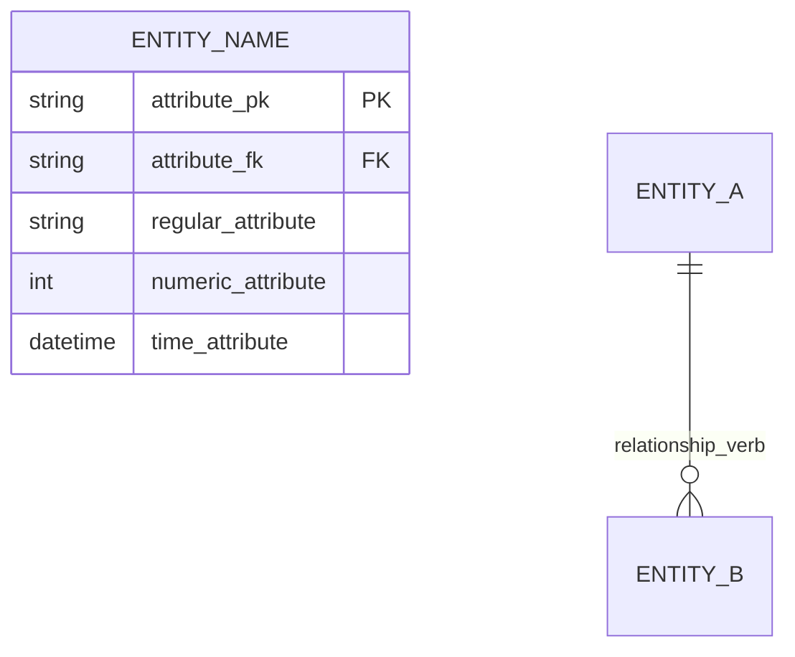

# Academic Database Design Methodology

A seven-step pipeline for turning a free-text business requirement description into
a complete, internally-consistent relational database design package, in the
Markdown deliverable format graded by most database-design coursework. Each step
produces one Markdown (and, from Step 5 onward, SQL) file that the *next* step
must read and stay consistent with — never redesign earlier decisions silently.

Treat this as a pipeline, not seven independent essays. The single biggest grading
risk in these assignments is **inconsistency between steps** (an attribute renamed
between the ERD and the logical schema, a cardinality that doesn't match the
participation constraints, a business rule mentioned in Step 1 that quietly
disappears from Step 5's `CHECK` constraints). Re-read every prior deliverable
before writing the next one.

## The Seven Steps

1. **Business Requirement Analysis** — extract purpose, actors, entities, attributes, relationships, cardinalities, and business rules from the prose requirement.
2. **Conceptual Database Design (ERD)** — diagram entities, attributes, relationships, cardinalities, participation constraints.
3. **Logical Database Design** — convert the ERD into relations with PK/FK/candidate keys and a data dictionary.
4. **Database Design Validation** — check the logical schema against the ERD and the business rules; flag gaps.
5. **Database Implementation (SQL DDL)** — tables, keys, constraints, checks, defaults.
6. **Sample Data Preparation** — realistic rows covering normal and exceptional cases.
7. **Query Design** — ≥5 business-relevant SQL queries, each with question, target user, rationale, and SQL.

Each is detailed below, with the exact formatting conventions to use so the output
matches professional/graded deliverables.

---

## Step 1 — Business Requirement Analysis

**Output:** `01-business-req-analysis-<group>.md`

Read the requirement description closely and extract, as explicit sections:

- **Business Purpose** — 2–4 sentences: what the system does, who it's for, what manual process it replaces, what the core guarantees are (e.g., "prevents overlapping bookings").
- **Actors** — a table of `Role | Description`. One row per distinct user role named or implied in the text (don't merge similar roles; "Lecturer" and "Teaching Assistant" are different actors even if their permissions overlap).
- **Entities & Attributes** — a table of `Entity Name | Description | Identified Attributes`, attributes listed as `attribute_name (PK)` / `(FK)` where applicable, comma-separated, in snake_case. Every noun in the requirement that has its own identity and independent attributes is a candidate entity — don't merge an entity into another's attribute list just because it's mentioned in the same sentence (e.g., "approval decision" with its own decider/time/note is its own entity, not three columns bolted onto the booking).
- **Relationships and Cardinalities** — one subsection per relationship, each with: the two entities and arity (`Entity (1) —— (N) Entity`), a `Relationship: <name>` / `Cardinality: 1:N` (or `1:1`, `M:N`) pair, and one sentence of plain-English explanation. Name relationships with the verb phrase from the text (submits, receives, performs, has, creates) — this name becomes the Mermaid edge label later, so keep it short and consistent.
- **Business Rules** — a flat bulleted list at the end, written as testable, declarative statements (not narrative). Every constraint mentioned anywhere in the source text must appear here exactly once — this list is what Step 5's `CHECK` constraints and Step 4's validation will be graded against, so don't lose anything here. Typical categories: uniqueness rules, time/ordering rules (`end > start`), state-dependent rules ("a space under maintenance cannot be booked"), required-field-on-event rules ("when rejected, must record reason"), and history/retention rules.

**Common mistake to avoid:** treating a status-and-decision sub-process (approval,
check-in/check-out, maintenance resolution) as mere attributes of the parent
entity instead of its own entity. If the source text says "the system records
who decided, when, and why" — that's an entity with its own PK, not three extra
columns.

---

## Step 2 — Conceptual Database Design (ERD)

**Output:** `02-erd-design-<group>.md`

### 2.1 Mermaid ER Diagram

Use Mermaid `erDiagram` syntax. Conventions:



- Entity names: `UPPER_SNAKE_CASE`, matching the Step 1 entity list exactly.
- Attribute names: `lower_snake_case`, matching Step 1 exactly — do not rename.
- Mark `PK` and `FK` inline after the type.
- Cardinality notation: `||` = exactly one, `o|` = zero or one, `||--o{` = one-to-many with optional many side, `||--||` = one-to-one. Pick the notation that matches the *actual* participation, not just "looks standard" — a `1:1` relationship that's optional on one side (e.g., a booking may have zero or one approval) should still render as `||--||` for cardinality in the summary table, with the optionality captured explicitly in the Participation Constraints section below, not silently dropped.
- Every FK-bearing entity gets one relationship line per FK.

### 2.2 Relationship Summary Table

Immediately after the diagram, restate every relationship as a table:
`Relationship | Cardinality`, phrased as `EntityA verb EntityB` / `1:N` (or
`1:1`, `M:N`). This must list the same relationships as the diagram, one row
each, in the same order.

### 2.3 Participation Constraints

Split into two subsections:

- **Total Participation** — list every "Every X must belong to/be performed by/etc. one Y" statement. These correspond to `NOT NULL` foreign keys later.
- **Partial Participation** — grouped by entity, list every "An X may have zero or many Y" statement. These correspond to nullable/optional foreign keys or optional child rows later.

Be exhaustive here — every relationship has a participation statement on *both*
ends, and both ends need to show up somewhere in this section.

---

## Step 3 — Logical Database Design

**Output:** `03-logical-design-<group>.md`

### 3.1 Relational Schema (compact notation)

One line per relation, in entity order matching Steps 1–2:

```
**RELATION_NAME** (**primary_key**, _foreign_key_, attribute, attribute, ...)
```

Bold = primary key, italics = foreign key, plain = regular attribute. State the
bold/italic convention explicitly in a one-line legend above the list.

For a relationship that is 1:1 and optional (e.g., booking↔approval), the **FK
side must also be the unique/PK side** — i.e., put the FK in the dependent
relation and make it both the PK (or a unique candidate key) of that relation.
Don't put a nullable FK on the "parent" side for an optional 1:1; that loses the
guarantee that at most one row exists per parent.

### 3.2 Logical Design Dictionary

One subsection per relation, each a table:
`Attribute | Data Type | Constraint | Description`.

- **Attribute**: bold the PK.
- **Data Type**: pick something concrete (`VARCHAR`, `INT`, `DATETIME`, `TEXT`, `BOOLEAN`) — don't leave types vague.
- **Constraint**: `Primary Key`, `Foreign Key`, `Not Null`, `Nullable`, `Candidate Key` (mark composite candidate keys as `Candidate Key (1/2)` / `(2/2)` so the reader knows they're paired), and call out any column enforcing a 1:1 relationship as `Foreign Key, Candidate Key` with a note that the `UNIQUE` constraint is what enforces the 1:1 cardinality.
- **Description**: one short phrase — what the column means and, for FKs, what it references (`References TABLE(column)`) and what role it plays if a table has multiple FKs to the same parent (e.g., `checked_in_by_user_id` and `completed_by_user_id` both reference `USER(user_id)` but represent different roles — say so).

**Common mistake to avoid:** when a relation has two-or-more FKs to the *same*
parent table (e.g., a maintenance record reported by one user and assigned to
another, both referencing `USER`), make sure each FK has a distinct, role-named
column (`reporter_user_id`, `assigned_staff_user_id`) — never reuse a single
generic `user_id` column for two different roles.

---

## Step 4 — Database Design Validation

**Output:** `04-design-validation-<group>.md`

Produce a checklist-style review, not free prose. For each of the following,
state pass/fail (or "partially satisfied") with one line of justification:

- **ERD ↔ Schema consistency** — every entity, attribute, relationship, and cardinality in Step 2 has a corresponding relation/column/FK/constraint in Step 3, with matching names.
- **Key correctness** — every relation has exactly one PK; every candidate key is identified; every FK references an existing PK/unique key in the correct parent table.
- **Cardinality enforcement** — for each 1:1, confirm the enforcing `UNIQUE` constraint is on the correct column; for each 1:N, confirm the FK lives on the "many" side; for any M:N, confirm a junction/bridge table exists with a composite key.
- **Business rule coverage** — go through the Step 1 business rules list one by one and state, for each, *how* it will be enforced (e.g., a `CHECK` constraint, an application-level rule, a trigger, or "not enforceable by schema alone — needs application logic," which is a legitimate and common answer for rules like "no overlapping approved bookings," since plain `CHECK` constraints can't compare across rows). Don't mark a rule "satisfied" if the honest answer is "needs a trigger or app-level check" — say so plainly; that's a correct and expected finding, not a failure of the design.
- **Normalization** — briefly justify that each relation is in at least 3NF (no partial or transitive dependencies on a non-key attribute); call out any deliberate denormalization if present.
- **Gaps/recommendations** — a short list of anything found wanting, with a suggested fix, even if it's deferred to Step 5 (e.g., "add a CHECK constraint for end_time > start_time" or "add an EXCLUDE/trigger for overlap prevention").

---

## Step 5 — Database Implementation (SQL DDL)

**Output:** `05-implementation-ddl-<group>.sql` (plus a short Markdown writeup if the assignment wants narrative alongside the SQL).

- `CREATE TABLE` statements in entity dependency order (parents before children referencing them).
- Explicit `PRIMARY KEY`, `FOREIGN KEY ... REFERENCES`, `UNIQUE` (for 1:1-enforcing columns and other candidate keys), `NOT NULL` per the Step 3 dictionary.
- `CHECK` constraints for every schema-enforceable business rule (e.g., `CHECK (requested_end_time > requested_start_time)`, `CHECK (status IN ('pending','approved','rejected','cancelled','checked_in','completed','no_show'))` using the *exact* value set named in Step 1 — don't invent new status values).
- Sensible `DEFAULT` values where the requirement implies one (e.g., a booking's status defaults to `'pending'`).
- For rules flagged in Step 4 as "not enforceable by a plain CHECK" (e.g., no-overlapping-approved-bookings), implement a trigger or document the application-level enforcement — don't silently drop the rule because SQL DDL alone can't express it.
- Comment each table briefly to say which entity it implements.

---

## Step 6 — Sample Data Preparation

**Output:** `06-sample-data-<group>.sql` (or `.md` with embedded SQL `INSERT`s, matching the assignment's expected format).

Insert enough rows to exercise:

- **Normal cases** — at least a few users per role, spaces of different types/statuses, bookings across multiple statuses (pending, approved, completed, rejected, cancelled, no-show), at least one full approval→check-in→completion chain, at least one maintenance record.
- **Exceptional/edge cases** that the business rules specifically call out: a rejected booking with a rejection reason, an attempted overlapping booking (to later demonstrate the constraint/query catches it), a space under maintenance, a no-show booking, a booking with no approval yet (pending), a booking with no usage session yet.
- Keep IDs human-readable and consistent with the ID format chosen in Step 5 (e.g., `U001`, `SP001`, `BK001`) so sample data is easy to read and queries in Step 7 are easy to write against.

---

## Step 7 — Query Design

**Output:** `07-queries-<group>.md`

At minimum the number of queries the assignment specifies (commonly ≥5). For
**each** query, use this exact structure:

```markdown
### Query N: <short title>

**Business question:** <one sentence, phrased as a question a real stakeholder would ask>

**Target user(s):** <which actor(s) from Step 1 would run this>

**Why it's useful:** <1–2 sentences>

```sql
<the SQL statement>
```
```

Favor queries that exercise the system's *stated goals* directly: detecting
overlapping/conflicting bookings, listing upcoming bookings, listing spaces
currently under maintenance, listing no-show bookings, computing space
utilization, finding a user's booking history. Mix at least one aggregation
(`GROUP BY`/`COUNT`), one multi-table `JOIN`, and one filtered/date-range query
so the set demonstrates range of SQL skill, not five variations of the same
pattern.

---

## Formatting Conventions Used Throughout (apply to every step)

- snake_case for all column/attribute names; UPPER_SNAKE_CASE for entity/table names.
- Markdown tables for every dictionary/summary; Mermaid for the ER diagram only.
- **Bold** = primary key, *italic* = foreign key, wherever schema notation appears inline in prose (not just in formal tables).
- State explicit value sets for every status-like attribute the first time it's introduced (Step 1), and reuse that exact set verbatim in every later step (ERD attribute, CHECK constraint, sample data, queries) — never let a status vocabulary drift between steps.
- Use the group's file-naming convention (`NN-short-name-<group>.md/.sql`) for every new deliverable, continuing the numbering already established by earlier files in the repo.

## Before Writing Anything

If earlier-step deliverables already exist in the repo (check `outputs/` or
equivalent), read all of them first. Extract the entity/attribute/key names and
business rules already locked in, and treat them as fixed inputs — the job is to
extend the pipeline forward, not to re-derive or silently alter prior decisions.
If a real flaw is found in an earlier step, flag it explicitly in the current
deliverable (e.g., in Step 4's Gaps/Recommendations) rather than quietly fixing
it elsewhere without comment.
