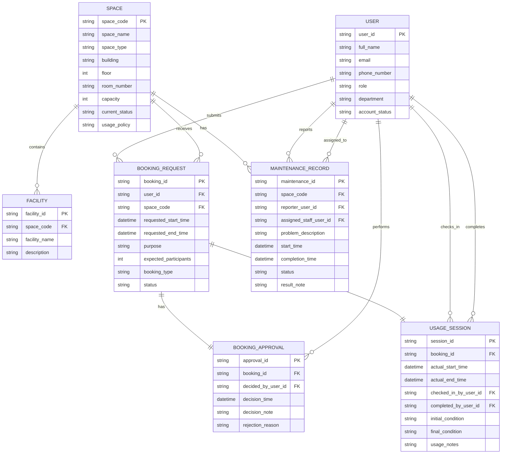

# 02-erd-design-G08.md

# Conceptual Database Design (ER Diagram)

## ER Diagram (Mermaid)

# Relationship Summary

| Relationship                          | Cardinality |
| ------------------------------------- | ----------- |
| Space contains Facility               | 1 : N       |
| User submits Booking_Request          | 1 : N       |
| Space receives Booking_Request        | 1 : N       |
| Booking_Request has Booking_Approval  | 1 : 1       |
| User performs Booking_Approval        | 1 : N       |
| Booking_Request creates Usage_Session | 1 : 1       |
| User checks in Usage_Session          | 1 : N       |
| User completes Usage_Session          | 1 : N       |
| Space has Maintenance_Record          | 1 : N       |
| User reports Maintenance_Record       | 1 : N       |
| User assigned to Maintenance_Record   | 1 : N       |

# Participation Constraints

## Total Participation

- Every Booking_Request must be submitted by one User.
- Every Booking_Request must belong to one Space.

- Every Booking_Approval must belong to one Booking_Request.
- Every Booking_Approval must be performed by one User.

- Every Usage_Session must belong to one Booking_Request.
- Every Usage_Session must be checked in by one User.
- Every Usage_Session must be completed by one User.

- Every Maintenance_Record must belong to one Space.
- Every Maintenance_Record must be reported by one User.
- Every Maintenance_Record must be assigned to one User.

- Every Facility must belong to one Space.

---

## Partial Participation

### User

- A User may have zero or many Booking_Requests.
- A User may have zero or many Booking_Approvals.
- A User may have zero or many Usage_Sessions (as check-in staff).
- A User may have zero or many Usage_Sessions (as completion staff).
- A User may have zero or many Maintenance_Records (as reporter).
- A User may have zero or many Maintenance_Records (as assigned staff).

### Space

- A Space may have zero or many Facilities.
- A Space may have zero or many Booking_Requests.
- A Space may have zero or many Maintenance_Records.

### Booking_Request

- A Booking_Request may have zero or one Booking_Approval.
- A Booking_Request may create zero or one Usage_Session.

# Notes

This ERD follows the business analysis and business rules defined in Phase 1 requirements.
